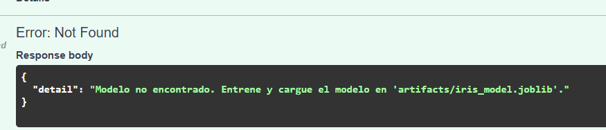
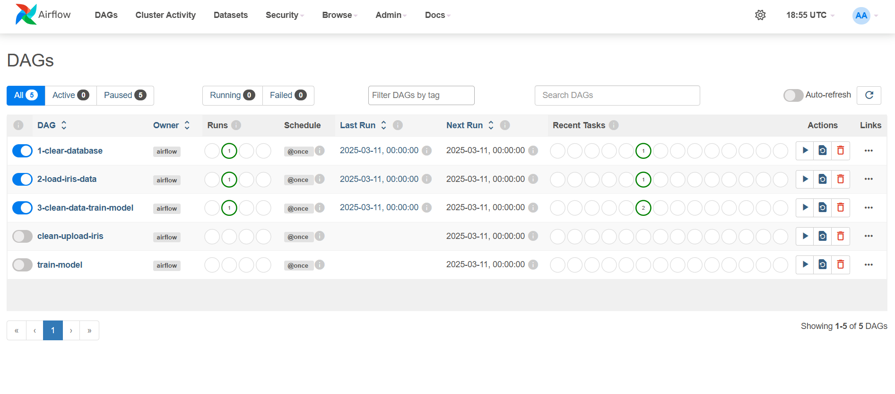
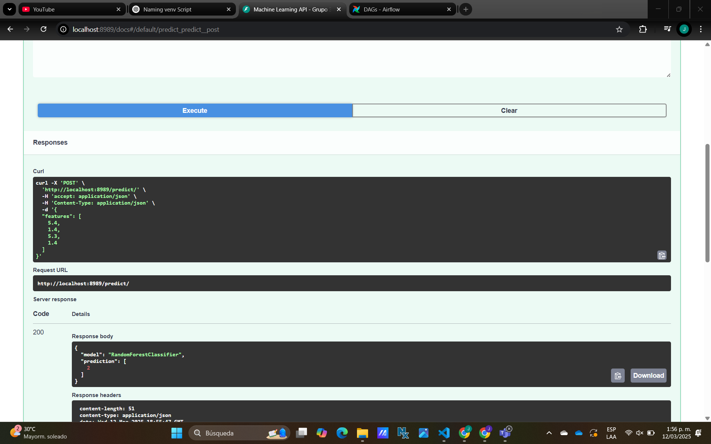

# Taller Airflow

Al archivo `docker-compose.yaml` que inicialmente estaba hecho para levantar la arquitectura de Airflow, se el agregaron los siguientes servicios:
- **mysql**: Instancia de MySQL que permite gestionar bases de datos para procesos de entrenamiento sin utilizar la base de datos PostgreSQL de Airflow.
- **fastapi**: Servicio que expone una API basada en FastAPI para realizar predicciones en tiempo real con el modelo de machine learning entrenado.

**CREDENCIALES AIRFLOW**

Usuario: taller-airflow

contraseña: airflow

*Cabe resaltar que, para que la API funcione correctamente, primero se deben seguir una serie de pasos en Airflow, incluyendo el entrenamiento del modelo. Si se intenta realizar una inferencia antes de entrenar, la API notificará al usuario que el modelo aún no ha sido generado y debe ser entrenado previamente.*

Para llegar al modelo que va a consumir el API, se agregaron los siguientes DAGs:

- **1-clear-database** (`dag_clear_database.py`): Este elimina la tabla `iris_raw` de la base de datos como se indicó en el taller. En este DAG no se usa un tipo de operador específico, se usa el TaskFlow API para definir tareas como funciones con `@task`, en lugar de `PythonOperator` u otros operadores tradicionales, mostrando una alternativa basada en decoradores, la cual es recomendada en las versiones más recientes de Airflow.
- **2-load-iris-data** (`dag_load_data.py`): Este DAG se encarga de leer el dataset de iris y cargarlo en la base de datos con el nombre `iris_raw`.  En este DAG se utiliza `PythonOperator` para definir las tareas. Este enfoque permite ejecutar funciones de Python mediante operadores explícitos, ofreciendo mayor flexibilidad en la configuración de parámetros y dependencias.
- **3-clean-data-train-model** (`dag_clean_train.py`): En este caso, se tienen dos tareas: `clean_data` y `train_model`, donde la primera lee la data cruda, quita duplicados, nulos y convierte el target de una variable de texto a numérica, que es como la debe recibir un modelo. Luego, la tarea `train_model` vuelve a leer la data ya preprocesada, entrena un modelo **RandomForestClassifier**, y lo guarda en un bind mount en `/opt/airflow/artifacts` utilizando `joblib`.

Luego de estos pasos la API funcionará correctamente:

