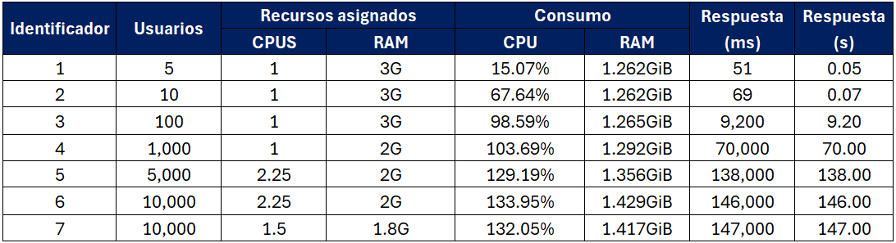

# Taller Locust

## Estructura del taller

Es muy importante aclarar que el taller se desarrolla teniendo levantados todos los servicios y la infraestructura (volúmenes manejados, red, entre otros) del proyecto 2. De esta manera, ya sabremos que los servicios de `minio` y `mlflow` están funcionando de manera correcta, y que la imagen para crear el contenedor de inferencia existe y funciona adecuadamente. 

A continuación, se observan los servicios del proyecto 2, y se puede notar que la imagen del servicio `inference-api` es `fast-api-mlflow`:


Para el taller, se genera el archivo de *compose* y las carpetas relacionadas con los servicios. Aunque inicialmente se utiliza una imagen ya construida de la aplicación de inferencia, la carpeta `app` se utiliza para crear otra imagen con una optimización específica para el caso de uso, la cual se explicará más adelante en detalle. A continuación se observa la estructura final:

```plain text
3-taller-locust/
├── app/
├── docker-compose.yaml
├── images/
├── locust/
└── README.md
```

## Paso 1. Publicar la imagen `fast-api-mlflow` en DockerHub

Antes de subir la imagen a DockerHub, se debe iniciar sesión. En nuestro caso, usamos `docker login` y realizamos el procedimiento con el browser.

Teniendo la imagen `fast-api-mlflow` con la etiqueta `latest`, se deben ejecutar los siguientes comandos para etiquetar la imagen para DockerHub (modificar el repositorio y la etiqueta según corresponda) y hacer push de la imagen:

```bash
docker tag fast-api-mlflow:latest jrpenagu/fast-api-mlflow:latest
docker push jrpenagu/fast-api-mlflow:latest
```

Se obtiene una confirmación de la publicación por consola y se verifica que la imagen se encuentre disponible en DockerHub:


## Paso 2. Despliegue de API y Locust

Se genera un archivo `docker-compose` para dos servicios: el API de inferencia y el servicio de `locust`. Ambos se incluyen en la red ya creada del proyecto 2. A continuación, se muestra cómo se vería el archivo inicialmente (sin réplicas ni configuración de recursos mínimos):

```yaml
services:
  api:
    image: jrpenagu/fast-api-mlflow:latest
    container_name: api-inferencia
    command: uv run uvicorn main:app --host 0.0.0.0 --port 8000
    ports:
      - "8000:8000"
    deploy:
      resources:
        limits:
          memory: 500G
          cpus: 0.5
    networks:
      - proyecto-2_default
    restart: "no"

  locust:
    build:
      context: ./locust
    container_name: locust
    ports:
      - "8089:8089"
    depends_on:
      - api
    environment:
      - LOCUST_HOST=http://api:8000
    networks:
      - proyecto-2_default
    restart: "no"

networks:
  proyecto-2_default:
    external: true
```

Inicialmente, se despliegan ambos servicios limitando el API de inferencia a solo 500 MB de memoria y 0.5 CPUs. Sin embargo, esta configuración no es suficiente para soportar la carga del modelo. Incluso al realizar una petición manual, el contenedor falla con código 137, lo que equivale a Terminado por SIGKILL (señal 9). Esto generalmente indica que el sistema operativo finalizó el contenedor por falta de memoria (OOM, Out Of Memory).


Se aumenta la cantidad de memoria con pasos de 100M y se llega a la conclusión que se requieren aproximadamente 1.3 GB para que la API funcione de base.

## Paso 3. Pruebas para recursos mínimos con 10,000 usuarios y crash de la VM

Inicialmente, se aumentaron considerablemente los recursos permitidos para comenzar las pruebas con los 10,000 usuarios, lo que provocó un bloqueo de la máquina virtual (VM), posiblemente debido a la alta cantidad de peticiones enviadas por `locust` sin posibilidad de detenerlo. **Este suceso permite sacar conclusiones sobre la importancia de limitar los recursos de un contenedor, teniendo en cuenta tanto los procesos que se ejecutan en el host como las necesidades del contenedor**. 

Se apagó la VM, suspendiendo todos sus procesos, y se procedió a asignar un *runtime* máximo de 150 segundos para las pruebas con `locust`, de modo que las peticiones se detuvieran después de este tiempo, evitando así la necesidad de reiniciar la máquina.

Debido al bloqueo, se optó por comenzar con pocos usuarios e ir incrementando gradualmente, tomando decisiones basadas en el monitoreo de los recursos consumidos por el contenedor mediante `docker stats`.

El resumen de estas pruebas se puede encontrar en la siguiente tabla:



Para garantizar que estos fueron los recursos mínimos encontrados, se soportan las cifras con capturas de pantalla tanto de las estadísticas de docker como de locust:


En este caso, se fue laxo a la hora de establecer el límite de memoria, ya que observamos que al bajar los servicios usando `docker compose down` y volverlos a iniciar, la carga del modelo puede consumir más o menos RAM. Sin embargo, a discreción del usuario, se podría limitar la RAM a 1.6 GB sin que el contenedor se detenga por sobreuso de memoria al cargar el modelo.

Habiendo identificado los recursos mínimos para que la API pueda atender solicitudes de los 10,000 usuarios, se consideró aumentar a 2 réplicas. Sin embargo, esto no fue posible debido al mapeo de puertos en Docker, ya que al escalar el servicio y mantener el mismo puerto publicado, cada contenedor intenta exponerse en el mismo puerto del host, lo que provoca un conflicto de asignación.


En ese momento, se reportó el error al profesor y, al no mostrarle el archivo YAML donde erróneamente se expuso el puerto, se mencionó que esto se solucionaría con el uso de un proxy o balanceador como NGINX o Traefik. Sin embargo, dado que los tiempos de respuesta eran demasiado altos, se propuso el reto de fijar algunos recursos razonables y evaluar cuál es el máximo número de usuarios para que la aplicación responda en tiempos coherentes.

**<span style="color:red">¡¡¡Posteriormente, el profesor identificó el problema y se procedió con el aumento de réplicas (Sección del paso 5). No obstante, se dejó documentada la sección que muestra el trabajo realizado para determinar el número de usuarios que la aplicación puede atender con tiempos de respuesta aceptables, así como la introducción de una imagen optimizada (que carga el modelo desde el inicio, entre otras mejoras)!!!</span>**


## Paso 4. Modificación al API para optimización del proceso y soporte de múltiples workers en uvicorn (aún no se había logrado aumentar réplicas)

Investigando la razón por la que la API no estaba utilizando más CPU, se encontró que, por defecto, Uvicorn usa solo un *worker*, y que es necesario declarar explícitamente el número de *workers* en los parámetros si se desea aumentar esta capacidad.

```Bash
uv run uvicorn main:app --host 0.0.0.0 --port 8000 --workers 2
```

Para poder aplicar este cambio, también se requiere hacer algunas optimizaciones en la API. Por ello, se crea otra imagen con la nueva aplicación y los siguientes cambios:

1. **Carga del modelo en `startup`:**  
   Se mueve la carga del modelo al evento `@app.on_event("startup")` para evitar que en la primera petición intente cargarlo. Este no tendría sentido en el proyecto 2, puesto que al levantar todos los servicios, no se había entrenado el modelo y el API no podría cargarlo.

2. **Implementación de `threading.Lock`:**  
   Se incorporó un `Lock` global (`model_lock`) para evitar que múltiples hilos intenten cargar el modelo al mismo tiempo.  
   Esto previene **condiciones de carrera**, especialmente al arrancar varios *workers* en paralelo.

También se aclara que Gunicorn es un gestor más robusto para procesos multithread, mientras que Uvicorn funciona adecuadamente en escenarios simples de prueba.

Se realizan pruebas con 10, 100 y 1,000 usuarios para distintas combinaciones de recursos, variando entre la imagen antigua y la nueva optimizada, guardada como `jrpenagu/fast-api-mlflow-optimized:latest`. 

Los parámetros que se modifican son la versión de la imagen, los *workers* asignados en el comando de Uvicorn y la RAM. Esta última se deja en 2.1 GB para todos los casos, ya que cada proceso (*worker*) es aislado con su propia memoria y el modelo debe estar cargado en cada uno de estos espacios.


De estas pruebas se observó que la nueva aplicación optimizada para más *workers* no tuvo el incremento en desempeño esperado. Se debería probar con otra solución que no consista en asignar más recursos a una sola instancia de la API, sino en desplegar varias instancias por separado. También se sugiere probar con Gunicorn. En este caso, el peor escenario es asignar más CPU a una instancia que no está optimizada para usar varios *workers*, y que fue definida para correr con solo uno usando Uvicorn. El mejor escenario, contra todo pronóstico, fue usando la iamgen inicial, un solo worker y asignando solo 1 cpu.

Finalmente, se define usar la primera combinación que fue la que mejor desempeño tuvo, para encontrar el número máximo de usuarios para tener un tiempo de respuesta coherente. Este punto se encuentra en 35:


## Paso 5. Aumento de réplicas y observaciones

Conociendo la solución de remover el mapeo de puerto, se procede a realizar experimentos aumentando el número de réplicas. El *set up* que se utilizará para los experimentos es el siguiente:

- **Imagen**: Optimizada, con carga del modelo en el *start-up* para evitar múltiples cargas durante las solicitudes.  
- **CPU asignada (por réplica)**: 1  
- **RAM asignada (por réplica)**: 1.3 GB  
- **Réplicas**: 1–3  

Los resultados son los siguientes:


#### 1. **Escalado a 2 réplicas**
- Mejora notable respecto a 1 réplica, pero los tiempos **no se dividen por la mitad**:
  - **35 usuarios:** baja de 2,800 ms → 1,100 ms.
  - **70 usuarios:** de 7,900 ms → 4,300 ms.
  - **100 usuarios:** de 8,000 ms → 6,600 ms.
- Aunque hay mejoras, la **disminución no es lineal ni proporcional**.
- Con 1000 usuarios aún hay latencias altas (71,000 ms).

A pesar de aumentar las réplicas puede que no sean suficiente para contrarestar el cuello de botella que genera la inferencia en cargas más altas, porque sí se observa una disminución con cargas normales, pero con cargas altas persiste el problema.


#### 2. **Escalado a 3 réplicas**
- Rendimiento **mucho más estable** incluso con cargas altas:
  - **10 usuarios:** 70 ms (igual que con 2 réplicas).
  - **1000 usuarios:** 66,000 ms (ligeramente mejor que con 2 réplicas).
- Para cargas medias:
  - **35 usuarios:** 150 ms (muy buena mejora vs 1,100 ms con 2 réplicas).
  - **70 usuarios:** 3,000 ms.
  - **100 usuarios:** 5,400 ms.

Esto sugiere que a partir de 3 réplicas el sistema maneja mejor la concurrencia, pero **los cuellos de botella persisten** a cargas muy altas. 

Se realiza una observación importante: a medida que se aumentaron las réplicas, la CPU dejó de ser un cuello de botella. Cuando solo había una réplica, el contenedor utilizaba el 100 % de la CPU. Con dos réplicas, los contenedores también se acercaban al 100 %, aunque sin alcanzarlo por completo. Ya con tres réplicas, los niveles de uso fueron mucho menores. Esto permitió identificar que se podrían aumentar significativamente las réplicas asignando menos recursos de CPU.

Luego de distintos intentos y configuraciones —algunos de los cuales causaron fallos en la máquina— se logró alcanzar un escenario estable con **5 réplicas, asignando 0.4 CPU** a cada una. Estos niveles ya hacen que el sistema trabaje cerca de su capacidad máxima tanto en memoria como en CPU:


Ya con este escenario, se obtienen tiempos menores para los 10,000 usuarios. Con una mediana de 56,000 ms, se logró una disminución del 23 % respecto al escenario con una sola réplica, manteniendo un promedio de 20 respuestas por segundo.


Adicionalmente, se identificó el punto óptimo de usuarios para el cual el sistema logra responder en tiempos coherentes. Este punto se encuentra entre 60 y 70 usuarios, casi duplicando el mínimo de usuarios concurrentes alcanzado en el escenario con una sola réplica. A continuación, se presentan los resultados obtenidos con `locust`:


