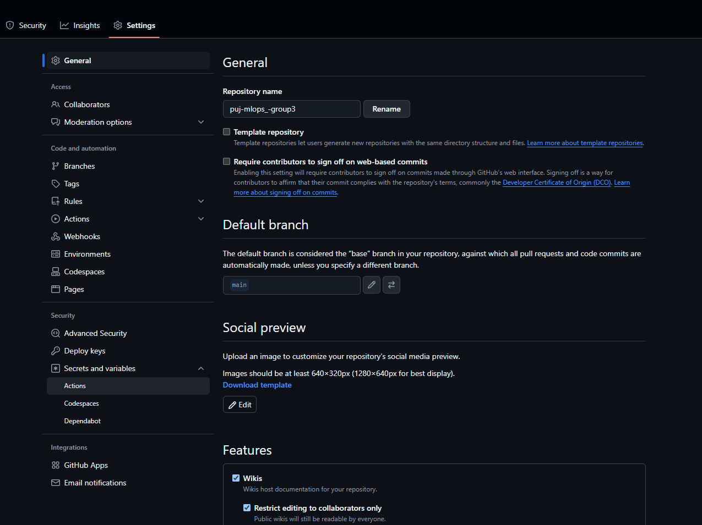
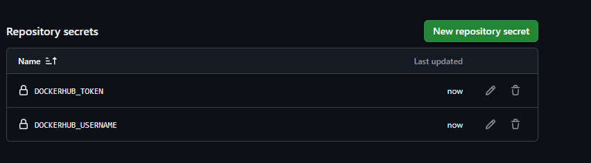
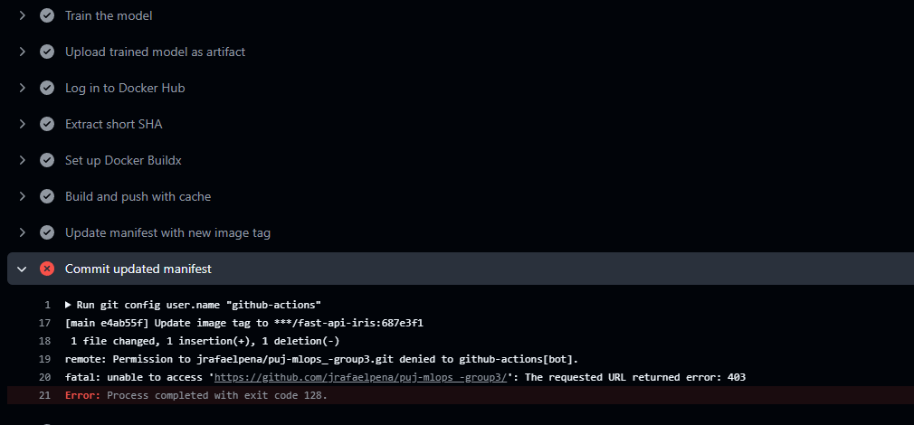
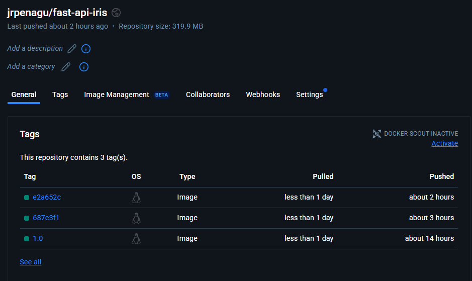
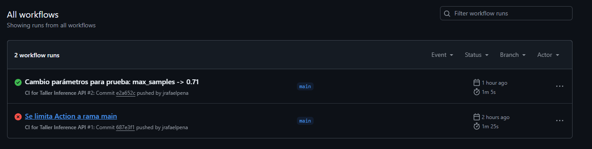
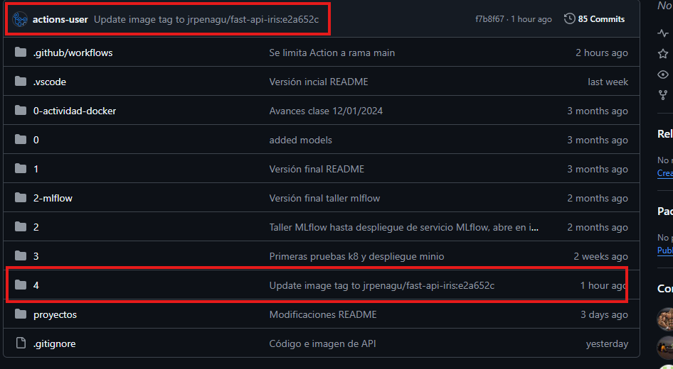
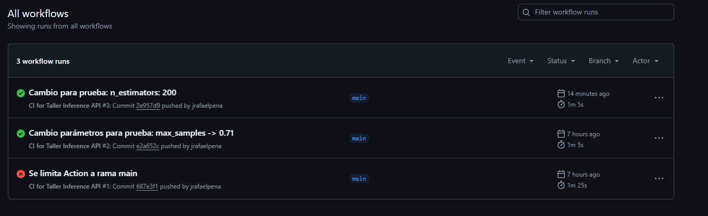
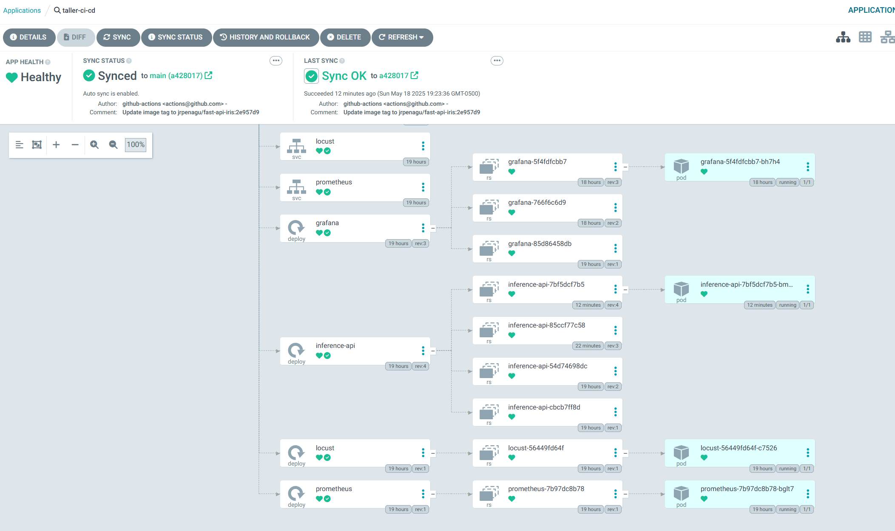
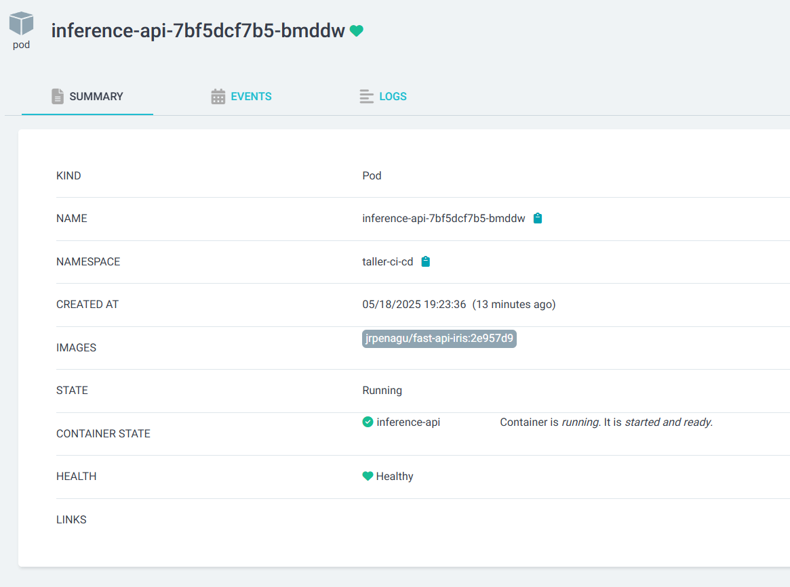

# Taller CI/CD

## Estructura proyecto

Para el taller se utiliza el conocido *dataset* de Iris para entrenar un modelo que posteriormente es expuesto a través de una API desarrollada con FastAPI. Se incorpora un servicio de pruebas de carga mediante Locust, así como Prometheus y Grafana para el monitoreo de métricas relacionadas con la API (como la cantidad de peticiones, latencia, entre otras). El repositorio de código está organizado de la siguiente manera:

```
taller-ci-cd
├── api-inferencia
│   ├── app
│   │   ├── main.py
│   │   ├── model.pkl
│   │   ├── params.yaml
│   │   ├── pyproject.toml
│   │   ├── train_model.py
│   │   └── uv.lock
│   └── Dockerfile
├── argo-cd
│   └── app.yaml
├── locust
│   ├── Dockerfile
│   ├── locustfile.py
│   └── requirements.txt
├── manifests
│   ├── api.yaml
│   ├── grafana-configMap.yaml
│   ├── grafana-dashboard-provider.yaml
│   ├── grafana-datasource.yaml
│   ├── grafana.yaml
│   ├── kustomization.yaml
│   ├── locust.yaml
│   ├── namespace.yaml
│   └── prometheus.yaml
└── README
```

## Desarrollo y despliegue de componentes

### Paso 1. Flujo de entrenamiento y sincronización con API

Para entrenar el modelo se crea un script sencillo llamado `train_model.py` en `api-inferencia/app`, donde se carga el *dataset* de Iris y se entrena un `RandomForestClassifier` utilizando parámetros definidos en el archivo `params.yaml`. Esto permite modificar los parámetros del modelo sin necesidad de alterar el código ni el script de entrenamiento. Posteriormente, este archivo será clave para activar el flujo de integración y actualización de las imágenes mediante GitHub Actions. A continuación, se muestra el script:

```python
# Load parameters from YAML file
with open('params.yaml', 'r') as file:
    config = yaml.safe_load(file)

params = config['model_parameters']

# Load the Iris dataset
iris = load_iris()
X = iris.data
y = iris.target

# Split into training and test sets
X_train, X_test, y_train, y_test = train_test_split(X, y, test_size=0.2, random_state=42)

# Initialize and train the Random Forest model
clf = RandomForestClassifier(**params, random_state=42)
clf.fit(X_train, y_train)

# Save the model to a .pkl file
model_filename = 'model.pkl'
with open(model_filename, 'wb') as f:
    pickle.dump(clf, f)

print(f"Model trained and saved as '{model_filename}'")
```

Posteriormente, se desarrolla la API para que cargue el archivo `.pkl` generado por el script de entrenamiento, e implemente los métodos `load_model`, `predict` y `metrics`. Para su despliegue, se crea una imagen de Docker que utiliza `uv` para la instalación de dependencias y que incluye el modelo directamente dentro de la imagen. Esta imagen fue optimizada utilizando una versión slim de Python y una construcción *multi-stage* basada en UV.

```Dockerfile
FROM python:3.12-slim

COPY --from=ghcr.io/astral-sh/uv:latest /uv /uvx /bin/

WORKDIR /app

COPY app/pyproject.toml .
COPY app/.python-version .
COPY app/main.py .
COPY app/uv.lock .
COPY app/model.pkl .

# Install dependencies
RUN uv sync --frozen

# Expose port 8989
EXPOSE 8989

CMD ["uv", "run", "uvicorn", "main:app", "--host", "0.0.0.0", "--port", "8989"]
```

La imagen resultante, `jrpenagu/fast-api-iris`, se publica en Docker Hub. Toda la lógica del modelo y de la API está contenida dentro de la imagen, sin utilizar *bind mounts*. Esto implica que, ante cualquier cambio en el modelo o en el código de la API, es necesario volver a generar la imagen, actualizar la versión correspondiente en el manifiesto de Kubernetes y aplicar los cambios para reflejar el nuevo estado deseado en el clúster.

### Paso 2. Construcción de manifiestos

Para el correcto despliegue en Kubernetes, se crea un nuevo *namespace* y los respectivos manifiestos de los componentes. En el diseño de estos manifiestos no hay cambios sustanciales con respecto a proyectos anteriores, pero se destacan algunos puntos importantes, como el uso de `ConfigMap`, aspecto en el que el profesor hizo especial hincapié.

Para Prometheus, se define un `ConfigMap` sencillo que especifica la URL objetivo para la recolección de métricas. En el caso de Grafana, se crean tres `ConfigMap` distintos:

- **grafana-datasource**: Define, desde el momento del despliegue, a Prometheus como la fuente de datos.
    ```yaml
    apiVersion: v1
    kind: ConfigMap
    metadata:
      name: grafana-datasource
      namespace: taller-ci-cd
    data:
      datasource.yaml: |
        apiVersion: 1
        datasources:
        - name: Prometheus
          type: prometheus
          access: proxy
          url: http://prometheus:9090
          isDefault: true
          uid: prometheus
          editable: true
    ```

- **grafana-dashboard-provider**: Define cómo y desde dónde Grafana debe cargar los tableros (dashboards). Este archivo le indica a Grafana que debe cargar dashboards desde archivos ubicados en el contenedor, concretamente en `/var/lib/grafana/dashboards`. De esta forma, se habilita el aprovisionamiento automático de tableros al momento del despliegue, sin necesidad de configurarlos manualmente en la interfaz de Grafana.
    ```yaml
    apiVersion: v1
    kind: ConfigMap
    metadata:
      name: grafana-dashboard-provider
      namespace: taller-ci-cd
    data:
      provider.yaml: |
        apiVersion: 1
        providers:
        - name: 'default'
          orgId: 1
          folder: ''
          type: file
          disableDeletion: false
          updateIntervalSeconds: 10
          allowUiUpdates: true
          options:
            path: /var/lib/grafana/dashboards
            foldersFromFilesStructure: false
    ```

- **grafana-dashboard-config**: Contiene el archivo JSON con la definición del tablero que muestra las métricas de monitoreo de la API recolectadas por Prometheus. Este archivo puede encontrarse en `manifests/grafana-configMap.yaml`.

### Paso 3. Creación de Workflow en Git Hub Actions

Para este apartado se define el archivo `ci-df.yaml`, que se ubica fuera del directorio del taller, en `.github/workflows`. Esta es la ubicación predeterminada donde GitHub busca archivos de workflows para ejecutarlos como parte de GitHub Actions.

Este flujo automatiza el proceso de integración continua (CI) para el modelo de inferencia. Cada vez que hay un cambio en el código fuente de la API o en el archivo `params.yaml`, o bien cuando se ejecuta manualmente, se realiza lo siguiente:

1. Se descarga el código del repositorio.
2. Se instala `uv`, el gestor de dependencias.
3. Se configura el entorno de Python según el archivo `.python-version`.
4. Se instalan las dependencias del proyecto.
5. Se ejecuta el script de entrenamiento del modelo.
6. El modelo entrenado (`model.pkl`) se guarda como artefacto.
7. Se inicia sesión en DockerHub.
8. Se construye una nueva imagen de Docker que incluye el modelo entrenado.
9. Se publica la imagen con una etiqueta única correspondiente al SHA corto del commit.
10. Se actualiza automáticamente el manifiesto de Kubernetes (`api.yaml`) con la nueva imagen.
11. Se hace un commit y un push de ese cambio al repositorio.

Este flujo se traduce en el siguiente YAML:

```yaml
name: CI for Taller Inference API

on:
  push:
    branches:
      - main
    paths:
      - '4/taller-ci-cd/api-inferencia/**'  # Cambios en el código fuente de la API
      - '4/taller-ci-cd/params.yaml'         # Cambios en los parámetros del modelo
  workflow_dispatch:  # Permite ejecutar el flujo manualmente desde la interfaz de GitHub

jobs:
  build-and-push:
    runs-on: ubuntu-latest
    env:
      IMAGE_NAME: jrpenagu/fast-api-iris  # Nombre de la imagen en DockerHub

    steps:
      - name: Checkout code
        uses: actions/checkout@v4  # Clona el repositorio en el runner

      - name: Install uv
        uses: astral-sh/setup-uv@v5  # Instala el gestor de dependencias uv
        with:
          version: 0.6.2

      - name: "Set up Python"
        uses: actions/setup-python@v5
        with:
          python-version-file: '4/taller-ci-cd/api-inferencia/app/.python-version'  # Usa la versión especificada

      - name: Install dependencies
        run: |
          cd 4/taller-ci-cd/api-inferencia/app
          uv sync --frozen  # Instala las dependencias definidas en pyproject.toml y uv.lock

      - name: Train the model
        run: |
          cd 4/taller-ci-cd/api-inferencia/app
          uv run train_model.py  # Entrena el modelo con los parámetros definidos

      - name: Upload trained model as artifact
        uses: actions/upload-artifact@v4  # Guarda el modelo entrenado para usarlo en pasos posteriores
        with:
          name: trained-model
          path: 4/taller-ci-cd/api-inferencia/app/model.pkl

      - name: Log in to Docker Hub
        uses: docker/login-action@v3  # Autenticación en DockerHub usando secretos del repositorio
        with:
          username: ${{ secrets.DOCKERHUB_USERNAME }}
          password: ${{ secrets.DOCKERHUB_TOKEN }}

      - name: Extract short SHA
        id: vars
        run: echo "sha_short=$(git rev-parse --short HEAD)" >> $GITHUB_OUTPUT  # Se usa como tag para la imagen

      - name: Set up Docker Buildx
        uses: docker/setup-buildx-action@v3  # Configura buildx para permitir cacheo y construcción avanzada

      - name: Build and push with cache
        uses: docker/build-push-action@v6  # Construye y publica la imagen usando cache de GitHub Actions
        with:
          context: 4/taller-ci-cd/api-inferencia
          push: true
          tags: |
            ${{ env.IMAGE_NAME }}:${{ steps.vars.outputs.sha_short }}
          cache-from: type=gha
          cache-to: type=gha,mode=max

      - name: Update manifest with new image tag
        run: |
          sed -i "s|image: .*|image: $IMAGE_NAME:${{ steps.vars.outputs.sha_short }}|" 4/taller-ci-cd/manifests/api.yaml
          # Actualiza el manifiesto para usar la nueva imagen

      - name: Commit updated manifest
        run: |
          git config user.name "github-actions"
          git config user.email "actions@github.com"
          git add 4/taller-ci-cd/manifests/api.yaml
          git commit -m "Update image tag to $IMAGE_NAME:${{ steps.vars.outputs.sha_short }}"
          git push  # Aplica el cambio del manifiesto al repositorio
```

Para este apartado también se debe tener en cuenta la creación de un token de acceso para iniciar sesión en Docker y, posteriormente, agregar estas credenciales en los Secrets del repositorio:




Asimismo, se debe otorgar permisos al usuario `github-actions` para poder hacer *pushes* en el repositorio, no solo permisos de lectura. Específicamente, se debe usar el permiso **Read & Write**, porque **Read, Write, Delete** es demasiado permisivo, a menos que se quiera también permitir la eliminación de recursos. Si se deja el permiso por defecto **Read-only**, se obtiene el siguiente error:



El resultado de este Workflow es la creación automática de imágenes Docker, la actualización del manifiesto con la nueva etiqueta de imagen y el *push* de estos cambios al repositorio:







### Paso 4. Despliegue continuo con Argo CD

El despliegue continuo se realiza con [Argo CD](https://argo-cd.readthedocs.io/). Para esto:

#### Kustomization

Se agrega un archivo `kustomization.yaml` con la siguiente estructura:

```yaml
apiVersion: kustomize.config.k8s.io/v1beta1
kind: Kustomization
namespace: taller-ci-cd
resources:
  - namespace.yaml
  - api.yaml
  - locust.yaml
  - prometheus.yaml
  - grafana.yaml
  - grafana-configMap.yaml
  - grafana-datasource.yaml
  - grafana-dashboard-provider.yaml
```

#### Registro en Argo CD

Antes de continuar, se instaló Argo CD con los siguientes comandos:

```bash
microk8s enable dns ingress
kubectl create namespace argocd  # Se crea el namespace para Argo CD
kubectl apply -n argocd -f https://raw.githubusercontent.com/argoproj/argo-cd/stable/manifests/install.yaml  # Instalación de Argo CD en el namespace argocd
```

Teniendo Argo CD instalado, se crea una carpeta en el repositorio del taller para Argo CD donde solo se crea el manifiesto para una aplicación de Argo CD con el siguiente contenido (`argo-cd/app.yaml`):

```yaml
# argo-cd/app.yaml
apiVersion: argoproj.io/v1alpha1
kind: Application
metadata:
  name: taller-ci-cd
  namespace: argocd  # Namespace donde se instaló Argo CD
spec:
  project: default

  source:
    repoURL: 'https://github.com/jrafaelpena/puj-mlops_-group3.git'  # Repositorio Git con los manifiestos
    targetRevision: main  # Rama principal
    path: 4/taller-ci-cd/manifests  # Ruta donde está el kustomization.yaml

  destination:
    server: 'https://kubernetes.default.svc'  # Clúster donde se desplegará (usualmente el mismo)
    namespace: taller-ci-cd

  syncPolicy:
    automated:  # Activar sincronización automática (despliegue continuo)
      prune: true  # Elimina recursos obsoletos
      selfHeal: true  # Corrige desviaciones del manifiesto
    syncOptions:
      - CreateNamespace=true  # Crea el namespace si no existe
```

Finalmente, se aplica este manifiesto con:

```bash
kubectl apply -f argo-cd/app.yaml
```

Y para monitoreo en UI:

```bash
kubectl -n argocd get secret argocd-initial-admin-secret -o jsonpath="{.data.password}" | base64 -d && echo
kubectl port-forward svc/argocd-server -n argocd 8080:443
```

---

## Resultado

* Las imágenes se construyen automáticamente al hacer push a `main`.
* Los manifiestos se actualizan con el nuevo tag.
* Argo CD detecta los cambios y sincroniza el estado del clúster automáticamente.
* Prometheus y Grafana monitorean métricas de la API.

Como última prueba, se modifican los parámetros del modelo y se realiza un nuevo *push* al repositorio. Automáticamente, Argo CD detecta el cambio, sincroniza la aplicación y actualiza los Pods con la nueva imagen `jrpenagu/fast-api-iris:2e957d9`:






