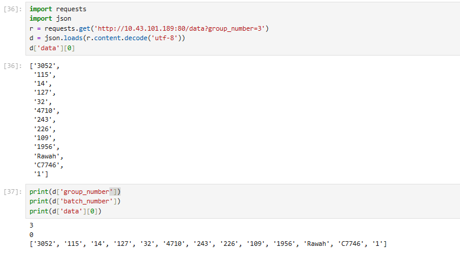
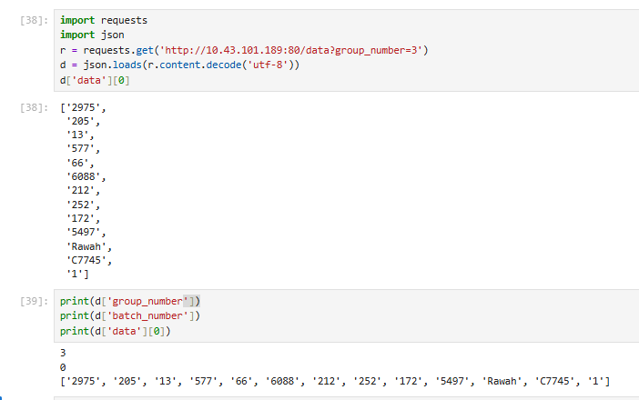
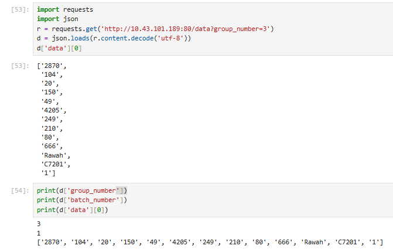

# Proyecto 2: Orquestación, métricas y modelos

## Paso 1. Despliegue de API que entrega dataset por lotes

En este apartado se despliega un contenedor que aloja el API. Cabe resaltar que se realizaron algunas modificaciones al código para mejorar la distribución de los datos en los lotes y evitar errores al alcanzar el final del conjunto de datos:

1. **Corrección en la asignación de lotes para garantizar la entrega de datos de distintos lotes en cada solicitud:**  
   - En el script original, la función `get_batch_data(group_number)` utilizaba el número del grupo (`group_number`) como si fuera el número de lote. Como `get_batch_data` en realidad espera recibir el número de lote, esto provocaba que un mismo grupo siempre recibiera datos del mismo lote en todas sus consultas.  
   - En la versión corregida, la asignación del lote se basa en el índice de lote almacenado en `timestamps[str(group_number)][1]`. Ahora, la llamada es `get_batch_data(timestamps[str(group_number)][1], batch_size)`, lo que garantiza que cada grupo reciba datos de distintos lotes a medida que avanza el proceso.

2. **Manejo adecuado del último lote para evitar errores por falta de datos:**  
   - Se ajustó la función `get_batch_data()` para evitar que el script intente acceder a un rango de datos fuera del tamaño del conjunto. Ahora, si el índice de finalización (`end_index`) excede la cantidad total de datos disponibles, se ajusta automáticamente a `len(data)`.  
   - Se incorporó `min(batch_size // 10, len(data[start_index:end_index]))` al muestreo aleatorio, asegurando que cuando los datos restantes sean menores al tamaño esperado, el muestreo siga funcionando sin fallos.

El archivo `main.py` del API, el `Dockerfile` utilizado y los archivos de requisitos para el despliegue se encuentran en la carpeta `api-data`. Para iniciar el contenedor, se deben ejecutar los siguientes comandos desde dicha carpeta:

```bash
docker build -t api-data-prof .
docker run --name api-data-prof -p 80:80 api-data-prof:latest
```

Se realizan múltiples ejecuciones en un notebook para verificar el comportamiento de la API en la asignación de lotes:  

1. **Primera ejecución**: Se consulta la API con el número de grupo `3` y se obtiene datos aleatorios del **lote 0**.  

     

2. **Ejecución repetida antes del tiempo mínimo de actualización**: Al ejecutar nuevamente la celda sin haber esperado el tiempo mínimo, la API devuelve datos aleatorios del **mismo lote (0)**.  

     

3. **Ejecución después de cumplido el tiempo de actualización**: Tras varias ejecuciones (pasando de la ejecución `38` a la `53` en el notebook), la API cambia al **lote 1** y entrega nuevos datos.  

    

> Vale la pena aclarar que para nunestra implementación el tiempo de mínimo de refresco es 120 segundos.

## Paso 2. Despliegue servicios del proyecto

Mediante el archivo `docker-compose.yaml` se levantan todos los servicios que componen el proyecto:

- Airflow (múltiples servicios: worker, scheduler, redis, postgres, etc)
- MLflow
- Minio
- MySql
- Fastapi

Se ha mantenido una estructura similar a la que se ha usado anteriormente, pero se resaltan los siguientes cambios que soportan la correcta automatización del proceso:

### Creación de servicio `minio-setup`

Se incluye este servicio `init` para automatizar la creación del bucket usado por `mlflow`. Se utiliza una imagen de `MinIO Client` y el contenedor se detiene una vez que ha completado la tarea:

```yaml
  minio-setup:
    image: quay.io/minio/mc:latest
    depends_on:
      - minio
    entrypoint: >
      /bin/sh -c "
      sleep 10 &&
      mc alias set myminio http://minio:9000 minioadmin minioadmin &&
      mc mb --ignore-existing myminio/mlflows3
      "
    environment:
      MINIO_ROOT_USER: minioadmin
      MINIO_ROOT_PASSWORD: minioadmin
    restart: "no"
```

### Creación de imagen personalizada para instalar dependencias en los servicios de AirFlow

Se utiliza `uv` y el archivo `pyproject.toml` de la carpeta `airflow` para la instalación de las dependencias adicionales que tiene le proyecto:

```Dockerfile
FROM apache/airflow:2.10.5

COPY --from=ghcr.io/astral-sh/uv:latest /uv /bin/

# Create the temp directory first
RUN mkdir -p /tmp/build

# Copy your pyproject.toml to the temp directory
COPY pyproject.toml /tmp/build/pyproject.toml

USER root
RUN cd /tmp/build && uv pip install --system .

USER airflow
```

### Se incluye script tipo SQL para la inicialización de una base de datos alterna a la de `mlflow`

Dentro de la carpeta `mysql-init` se encuentra el script `init.sql`, que será utilizado por el contenedor (con bind mount `./mysql-init:/docker-entrypoint-initdb.d`) para crear automáticamente una nueva base de datos y la tabla para almacenar la información obtenida del API. Esta base de datos será utilizada por el usuario para almacenar los datos de entrenamiento:

```SQL
CREATE DATABASE IF NOT EXISTS train_data;
CREATE USER IF NOT EXISTS 'airflow'@'%' IDENTIFIED BY 'airflow';
GRANT ALL PRIVILEGES ON train_data.* TO 'airflow'@'%';
FLUSH PRIVILEGES;

USE train_data;
DROP TABLE IF EXISTS forest_cover_data;

CREATE TABLE forest_cover_data (
    id INT AUTO_INCREMENT PRIMARY KEY,
    Elevation FLOAT,
    Aspect FLOAT,
    Slope FLOAT,
    Horizontal_Distance_To_Hydrology FLOAT,
    Vertical_Distance_To_Hydrology FLOAT,
    Horizontal_Distance_To_Roadways FLOAT,
    Hillshade_9am FLOAT,
    Hillshade_Noon FLOAT,
    Hillshade_3pm FLOAT,
    Horizontal_Distance_To_Fire_Points FLOAT,
    Wilderness_Area VARCHAR(50),
    Soil_Type VARCHAR(50),
    Cover_Type VARCHAR(50),
    batch_number INT,
    timestamp DATETIME,
    UNIQUE KEY unique_record (
        Elevation, Aspect, Slope, 
        Horizontal_Distance_To_Hydrology, Vertical_Distance_To_Hydrology,
        Horizontal_Distance_To_Roadways,
        Hillshade_9am, Hillshade_Noon, Hillshade_3pm,
        Horizontal_Distance_To_Fire_Points, 
        Wilderness_Area, Soil_Type, Cover_Type
    )
);
```

Y adicionalmente, se agregan estas credenciales como variables de entorno a los servicios de airflow:

```yaml
# MySQL Credentials for Airflow
MYSQL_HOST: mysql
MYSQL_PORT: 3306
MYSQL_DATABASE: train_data
MYSQL_USER: airflow
MYSQL_PASSWORD: airflow
```

## Paso 3. Pasos en Airflow

Se debe ejecutar el primer dag que es `forest_cover_data_extraction` asociado al archivo `lectura_datos.py`, este realiza las dos siguientes tareas