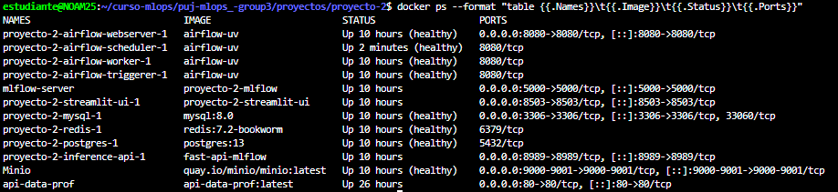
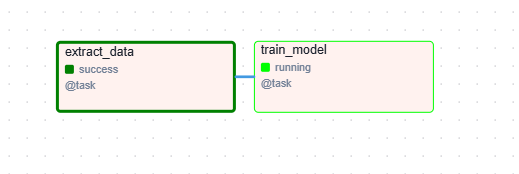
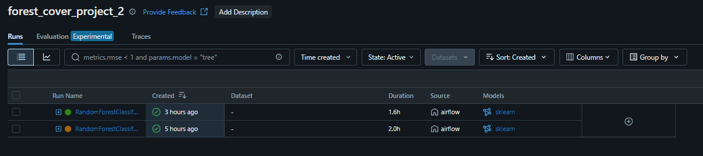
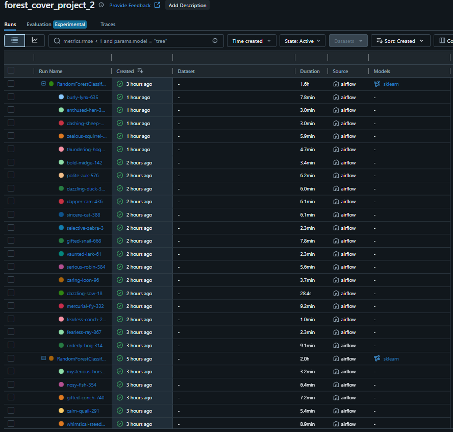
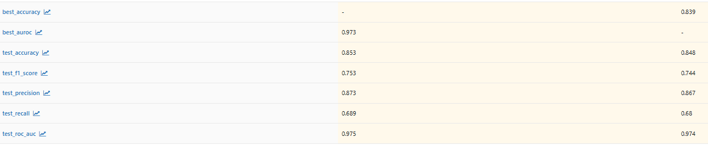
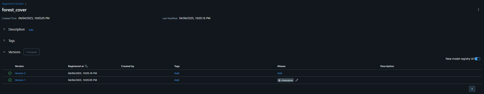
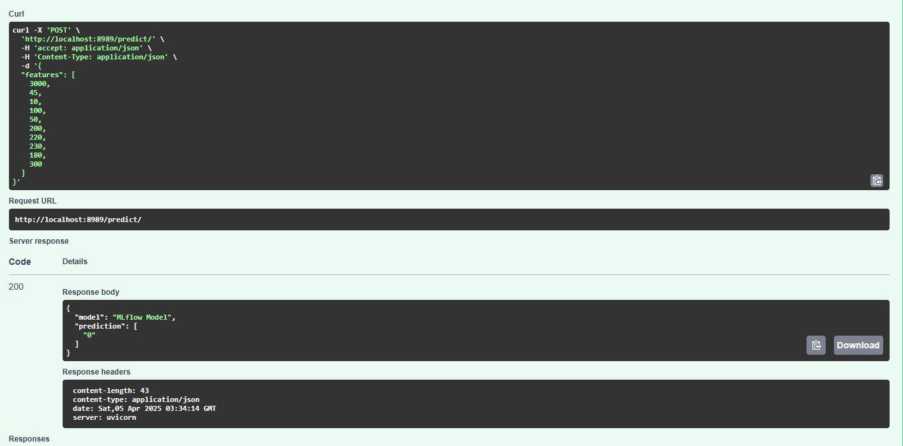
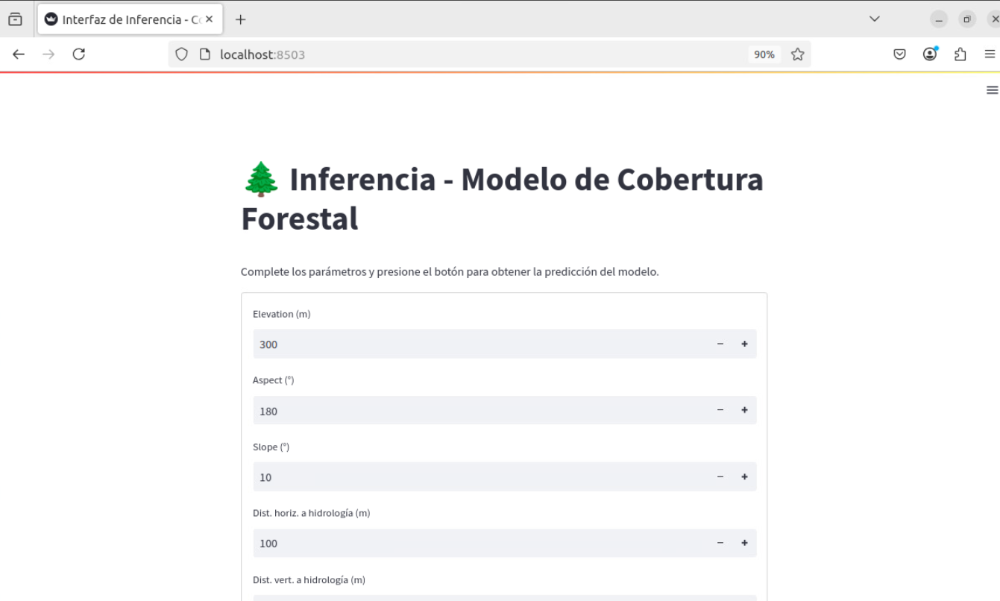
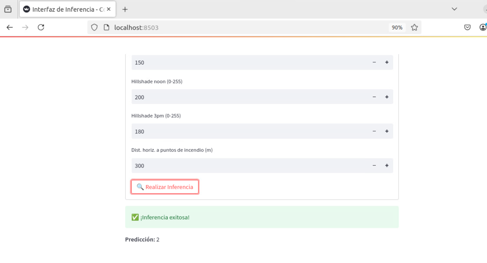

# Proyecto 2: Orquestación, métricas y modelos

## Estructura del proyecto

Las carpetas principales del proyecto son las siguientes:

```md
proyecto-2/
├── airflow/
├── api-data/
├── app/
├── minio/
├── mlflow/
├── mysql-init/
└── streamlit/    
```

Cada una de estas carpetas contiene archivos como `Dockerfile`, scripts o subcarpetas utilizadas como *bind mounts* por los distintos servicios. En pasos posteriores se explicarán los archivos específicos que utiliza cada servicio.

## Paso 1. Despliegue de API que entrega dataset por lotes

En este apartado se despliega un contenedor que aloja el API. Cabe resaltar que se realizaron algunas modificaciones al código para mejorar la distribución de los datos en los lotes y evitar errores al alcanzar el final del conjunto de datos:

1. **Corrección en la asignación de lotes para garantizar la entrega de datos de distintos lotes en cada solicitud:**  
   - En el script original, la función `get_batch_data(group_number)` utilizaba el número del grupo (`group_number`) como si fuera el número de lote. Como `get_batch_data` en realidad espera recibir el número de lote, esto provocaba que un mismo grupo siempre recibiera datos del mismo lote en todas sus consultas.  
   - En la versión corregida, la asignación del lote se basa en el índice de lote almacenado en `timestamps[str(group_number)][1]`. Ahora, la llamada es `get_batch_data(timestamps[str(group_number)][1], batch_size)`, lo que garantiza que cada grupo reciba datos de distintos lotes a medida que avanza el proceso.

2. **Manejo adecuado del último lote para evitar errores por falta de datos:**  
   - Se ajustó la función `get_batch_data()` para evitar que el script intente acceder a un rango de datos fuera del tamaño del conjunto. Ahora, si el índice de finalización (`end_index`) excede la cantidad total de datos disponibles, se ajusta automáticamente a `len(data)`.  
   - Se incorporó `min(batch_size // 10, len(data[start_index:end_index]))` al muestreo aleatorio, asegurando que cuando los datos restantes sean menores al tamaño esperado, el muestreo siga funcionando sin fallos.

El archivo `main.py` del API, el `Dockerfile` utilizado y los archivos de requisitos para el despliegue se encuentran en la carpeta `api-data`. Para iniciar el contenedor, se deben ejecutar los siguientes comandos desde dicha carpeta:

```bash
docker build -t api-data-prof .
docker run --name api-data-prof -p 80:80 api-data-prof:latest
```

Se realizan múltiples ejecuciones en un notebook para verificar el comportamiento de la API en la asignación de lotes:  

1. **Primera ejecución**: Se consulta la API con el número de grupo `3` y se obtiene datos aleatorios del **lote 0**.  

     

2. **Ejecución repetida antes del tiempo mínimo de actualización**: Al ejecutar nuevamente la celda sin haber esperado el tiempo mínimo, la API devuelve datos aleatorios del **mismo lote (0)**.  

     

3. **Ejecución después de cumplido el tiempo de actualización**: Tras varias ejecuciones (pasando de la ejecución `38` a la `53` en el notebook), la API cambia al **lote 1** y entrega nuevos datos.  

    

> Vale la pena aclarar que para la implementación final y de entrega el tiempo mínimo de refresco es de 30 segundos.

## Paso 2. Despliegue servicios del proyecto

Mediante el archivo `docker-compose.yaml` se levantan todos los servicios que componen el proyecto:

- Airflow (múltiples servicios: worker, scheduler, redis, postgres, etc)
- MLflow
- Minio
- MySql
- Inferene API
- Streamlit UI




Se ha mantenido una estructura similar a la utilizada anteriormente para desplegar servicios como `airflow`, `mysql`, etc., pero se destacan los siguientes cambios que permiten una correcta automatización del proceso:

### Creación de servicio `minio-setup`

Se incluye este servicio `init` para automatizar la creación del bucket usado por `mlflow`. Se utiliza una imagen de `MinIO Client` y el contenedor se detiene una vez que ha completado la tarea:

```yaml
  minio-setup:
    image: quay.io/minio/mc:latest
    depends_on:
      - minio
    entrypoint: >
      /bin/sh -c "
      sleep 10 &&
      mc alias set myminio http://minio:9000 minioadmin minioadmin &&
      mc mb --ignore-existing myminio/mlflows3
      "
    environment:
      MINIO_ROOT_USER: minioadmin
      MINIO_ROOT_PASSWORD: minioadmin
    restart: "no"
```

### Creación de imagen personalizada para instalar dependencias en los servicios de Airflow

Se utiliza `uv` y el archivo `pyproject.toml` ubicado en la carpeta `airflow` para instalar las dependencias adicionales que requiere el proyecto en la imagen de `airflow`:

```Dockerfile
FROM apache/airflow:2.10.5

COPY --from=ghcr.io/astral-sh/uv:latest /uv /bin/

RUN mkdir -p /tmp/build

COPY pyproject.toml /tmp/build/pyproject.toml

USER root
RUN cd /tmp/build && uv pip install --system --python=/home/airflow/.local/bin/python .

USER airflow
```

Adicionalmente, se debe modificar la sección `x-airflow-common` para que todos los servicios asociados a Airflow utilicen esta imagen con las dependencias correctamente instaladas.

```yaml
x-airflow-common:
  &airflow-common
  image: airflow-uv
  build:
    context: ./airflow
```

### Definición de user id para mitigar problemas de permisos con carpetas relacionadas a los servicios de airflow

Se debe definir la variable `AIRFLOW_UID` en un archivo `.env` para especificar el ID de usuario con el que se creará el contenedor. Si no se define, carpetas como `logs`, `config` y otras serán creadas por el usuario `root`, lo que impediría que el usuario `airflow` tenga permisos para modificarlas.

Ejemplo de archivo `.env`:

```.env
AIRFLOW_UID=1001
_AIRFLOW_WWW_USER_USERNAME=proyecto-2
_AIRFLOW_WWW_USER_PASSWORD=proyecto2
```

### Se incluye script tipo SQL para la inicialización de una base de datos alterna a la de `mlflow`

Dentro de la carpeta `mysql-init` se encuentra el script `init.sql`, que será utilizado por el contenedor (con bind mount `./mysql-init:/docker-entrypoint-initdb.d`) para crear automáticamente una nueva base de datos y la tabla para almacenar la información obtenida del API. Esta base de datos será utilizada por el usuario para almacenar los datos de entrenamiento:

```SQL
CREATE DATABASE IF NOT EXISTS train_data;
CREATE USER IF NOT EXISTS 'airflow'@'%' IDENTIFIED BY 'airflow';
GRANT ALL PRIVILEGES ON train_data.* TO 'airflow'@'%';
FLUSH PRIVILEGES;

USE train_data;
DROP TABLE IF EXISTS forest_cover_data;

CREATE TABLE forest_cover_data (
    id INT AUTO_INCREMENT PRIMARY KEY,
    Elevation FLOAT,
    Aspect FLOAT,
    Slope FLOAT,
    Horizontal_Distance_To_Hydrology FLOAT,
    Vertical_Distance_To_Hydrology FLOAT,
    Horizontal_Distance_To_Roadways FLOAT,
    Hillshade_9am FLOAT,
    Hillshade_Noon FLOAT,
    Hillshade_3pm FLOAT,
    Horizontal_Distance_To_Fire_Points FLOAT,
    Wilderness_Area VARCHAR(50),
    Soil_Type VARCHAR(50),
    Cover_Type VARCHAR(50),
    batch_number INT,
    timestamp DATETIME,
    UNIQUE KEY unique_record (
        Elevation, Aspect, Slope, 
        Horizontal_Distance_To_Hydrology, Vertical_Distance_To_Hydrology,
        Horizontal_Distance_To_Roadways,
        Hillshade_9am, Hillshade_Noon, Hillshade_3pm,
        Horizontal_Distance_To_Fire_Points, 
        Wilderness_Area, Soil_Type, Cover_Type
    )
);
```

Y adicionalmente, se agregan estas credenciales como variables de entorno a los servicios de airflow:

```yaml
# MySQL Credentials for Airflow
MYSQL_HOST: mysql
MYSQL_PORT: 3306
MYSQL_DATABASE: train_data
MYSQL_USER: airflow
MYSQL_PASSWORD: airflow
```

## Paso 3. Ejecución DAG en ariflow

Se debe ejecutar el DAG `1-forest_cover_training-pipeline`, asociado al archivo `training-pipeline.py`. En este se definen dos tareas: `extract_data` y `train_model`. La primera, como su nombre lo indica, se encarga de solicitar al API los datos, dejando el tiempo suficiente para que se actualicen los *batches*. Como resultado, se obtiene un 10% de datos aleatorios de cada uno de los 10 lotes del conjunto de datos.

Vale la pena aclarar que, inicialmente, se consideraron otras aproximaciones, como crear un DAG para cada tarea y usar los parámetros del DAG, como `schedule_interval`, para repetir la ejecución dejando el tiempo mínimo de actualización que requiere el API. El DAG finalizaría después de completar las 10 ejecuciones, utilizando `AirflowSkipException`. Por esta razón, se incluyen otros scripts de Python con dichas pruebas.

Sin embargo, por varios motivos, se optó por definir toda la estructura en un solo DAG y dividir el proceso en tareas (`extract_data` y `train_model`). 

La justificación desde un punto de vista práctico es que este puede considerarse un mismo pipeline  repetitivo de entrenamiento, y no tendría mucho sentido dividirlo en DAGs distintos, ya que para eso existen las *tasks*, que permiten establecer dependencias entre pasos. Por otro lado, en equipos con múltiples procesos de ML, tener un DAG para cada paso podría saturar la vista general del entorno de trabajo (esto depende del equipo, pero es la visión compartida por los integrantes del grupo).

 

Ya profundizando en el DAG, la tarea `train_model` implementa Optuna y MLflow para realizar una búsqueda de hiperparámetros, optimizando dos métricas: Accuracy y Area Under the Receiver Operating Characteristic Curve (AUROC).

Para cada una de estas métricas se definen 20 iteraciones, que se registran en MLflow como *runs* anidadas. Al finalizar, se guarda el modelo que obtuvo el mejor desempeño para cada una de las dos métricas definidas. Y este sería un ejemplo para ejecutar las 20 iteraciones y guardar el mejor modelo:

```python
with mlflow.start_run(experiment_id=exp_id, run_name=run_name, nested=True):

      study = optuna.create_study(direction="maximize")
      

      study.optimize(
         make_objective_rf_auroc(X_train, y_train),
         n_trials=20,
         callbacks=[champion_callback]
      )

      mlflow.log_params(study.best_params)
      mlflow.log_metric("best_auroc", study.best_value)

      mlflow.set_tags(
         tags={
            "project": "Taller MLFlow",
            "optimizer_engine": "optuna",
            "model_family": "RandomForestClassifier",
            "Optimization metric": "AUROC",
         }
      )

      model = RandomForestClassifier(**study.best_params, random_state=42, n_jobs=-1)
      model.fit(X_train, y_train)
      
      test_metrics = custom_reports(model, X_test, y_test)
      mlflow.log_metrics(test_metrics)

      artifact_path = "model_rf_auroc"

      mlflow.sklearn.log_model(
         sk_model=model,
         artifact_path=artifact_path,
         metadata={"model_data_version": 1},
      )
```

## Paso 4. Revisión de métricas en MLFlow

Cuando el DAG culmina con éxito, se puede confirmar que hay dos modelos asociados a las *runs* principales: uno con hiperparámetros optimizados para maximizar el Accuracy y otro para maximizar el AUROC. 

A continuación, se pueden observar las dos *runs* principales en MLflow, así como las *runs* anidadas correspondientes a las iteraciones de búsqueda realizadas por Optuna:

 

 

Posteriormente, se registran ambos estimadores en el modelo `forest_cover`, y asignar el alias *champion* al de mejor desempeño con la herramienta de comparación:



Se asigna el alias *champion* al modelo que optimizó el AUROC:




## Paso 4. API inferencia y UI con streamlit

Antes de usar la ui construida con `streamlit` se valida que el API para inferencia esté funcionando de manera correcta:



Validando que el API está logrando conectar con el servicio de `mlflow` y generando predicciones, se procede a realizar inferencias con `streamlit`:



