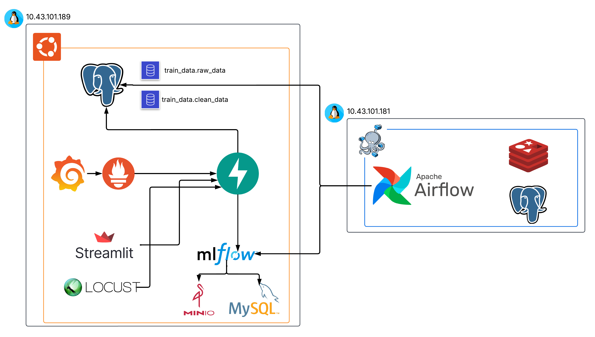
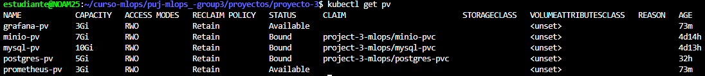
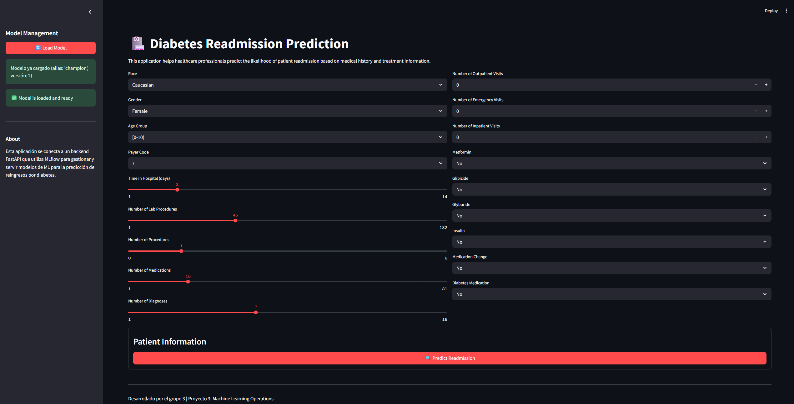
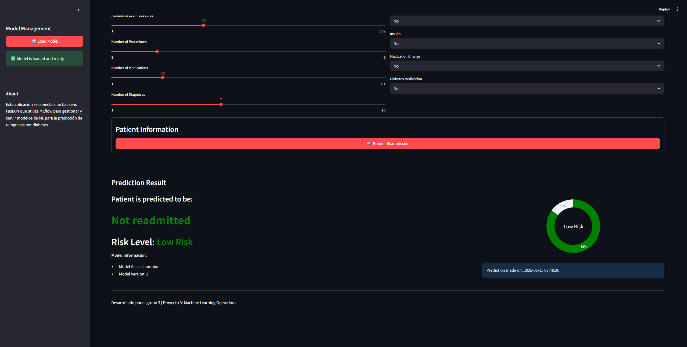
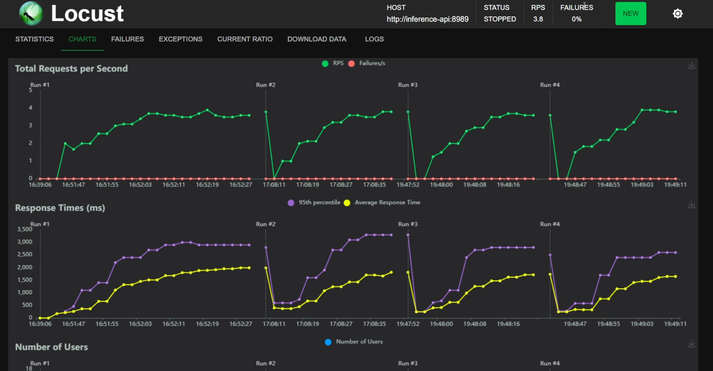
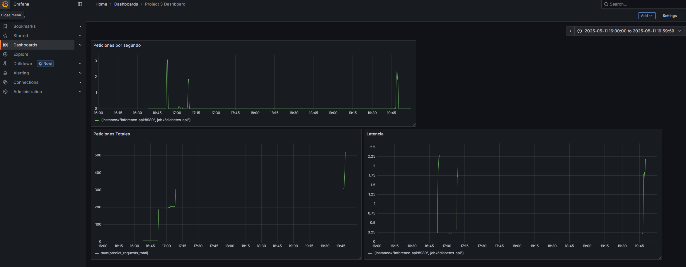

# Proyecto 3: Kubernetes, Prometheus y Grafana

### [🎥 Ver video en YouTube](https://youtu.be/SKmrt0lwFZg)


## Arquitecura del proyecto



Como se puede observar en la imagen superior, se utilizaron dos máquinas virtuales. Una de ellas se destinó exclusivamente al despliegue de los servicios relacionados con Apache Airflow, exponiendo únicamente el *webserver*. Para este propósito se utilizó **Docker Compose**.

En la otra máquina virtual, que aloja la mayoría de los servicios restantes, se empleó **MicroK8s** como orquestador, desplegando todos los componentes dentro de un mismo *namespace* de **Kubernetes**.

## Estructura del repositorio

Se creó una carpeta para cada uno de los servicios, donde se almacenan los archivos correspondientes a los recursos de tipo *Deployment*, *Service* y *PersistentVolumeClaim* (PVC), cuando son requeridos. Además, se creó una carpeta separada para los archivos relacionados con los recursos de tipo *PersistentVolume* (PV), ya que estos no están ligados a un *Pod* específico y pueden ser reclamados por cualquier *claim*. Las carpetas `hostPath` asociadas a los PV se encuentran fuera del repositorio.

```md
proyecto-3
├── airflow
├── grafana
├── images
├── inference-api
├── locust
├── minio
├── mlflow
├── mysql
├── observability
├── postgres
├── project-namespace.yaml
├── prometheus
├── pvs
├── README.md
└── streamlit
```

## Paso 1. Aseguramiento de imágenes

Dado que Kubernetes se encarga de orquestar contenedores pero no de construir imágenes, es necesario garantizar que todas las imágenes personalizadas estén disponibles en un repositorio como **Docker Hub**. En este proyecto, algunos servicios utilizan imágenes estándar proporcionadas por las tecnologías correspondientes, mientras que otros requieren imágenes personalizadas, ya sea reutilizadas de un proyecto anterior o creadas específicamente para este entorno. En estos casos, las imágenes personalizadas deben subirse previamente al repositorio de Docker Hub.

Un ejemplo claro de esta necesidad es el caso de la segunda máquina virtual, que debe utilizar una imagen personalizada de **Airflow** con las librerías necesarias para el entrenamiento. Para ello, se utilizan los siguientes comandos:

```bash
docker tag airflow-uv:latest jrpenagu/airflow-uv-ml:latest
docker push jrpenagu/airflow-uv-ml:latest 
```
Para los servicios de `inference-api`, `locust` y `streamlit`, se construyeron primero las imágenes, ya que dependen de nuevos desarrollos ajustados a los datos actualizados del caso de diabetes y a nuevos requerimientos específicos.

## Paso 2. Creación de *namespace* para proyecto

Con el fin de tener un entorno aislado para todos los despliegues del proyecto y garantizar que estos se encuentren en una misma red, donde puedan comunicarse entre sí utilizando únicamente sus nombres de servicio, se creó el *namespace* `project-3-mlops` con el siguiente manifiesto en YAML:

```yaml
apiVersion: v1
kind: Namespace
metadata:
  name: project-3-mlops
```

## Paso 3. Creación de PVs

Se crean todos los PVs que posteriormente serán reclamados por los *PersistentVolumeClaims* (PVCs) definidos en los despliegues. En total, se crean tres PVs, correspondientes a los servicios de `postgres`, `minio` y `mysql`:



## Paso 4. Carga de datos y entrenamiento de modelo

Una vez desplegados los servicios de `postgres` y `mlflow` (incluyendo sus servicios dependientes), se procede con la carga de datos y el entrenamiento del modelo a través de **Airflow**. Para ello, se crea el **DAG** `1-diabetes-training-pipeline`, que sigue el siguiente flujo:


En la tarea de `extract_data` se implementa el requerimiento de carga por lotes de 15,000 en la tabla `raw_data`:

``` python
# Step 4: Insert in batches of 15,000
batch_size = 15000
total_rows = len(df)
print(f'Inserting {total_rows} rows into raw_data in batches of {batch_size}')

for i in range(0, total_rows, batch_size):
    batch_df = df.iloc[i:i + batch_size]
    batch_df.to_sql("raw_data", con=engine, if_exists="append", index=False)
    print(f'Inserted rows {i} to {i + len(batch_df) - 1}')

print('All data inserted successfully')
```

En la siguiente tarea `preprocess_and_split` se eliminan columnas no relevantes, se divide toda la tabla en distintos dataset (entrenamiento, test y validación) y se inserta la data en `clean_data`:

``` python
# Stratified split for the target column `readmitted`
train_df, temp_df = train_test_split(df, stratify=df['readmitted'], test_size=0.4, random_state=42)
val_df, test_df = train_test_split(temp_df, stratify=temp_df['readmitted'], test_size=0.5, random_state=42)

train_df['dataset'] = 'train'
val_df['dataset'] = 'validation'
test_df['dataset'] = 'test'

final_df = pd.concat([train_df, val_df, test_df])

# Save to new table
final_df.to_sql("clean_data", con=engine, if_exists="replace", index=False)
```
Finalmente en las últimas dos tareas paralelas `train_model_accuracy` y `train_model_auroc` se entrenan dos modelos de Random Forest, usando optuna para la optimización de hiperparámetros y registrando el mejor modelo para cada métrica.

Usando la interfaz de Mlflow se comparan los modelos y se marca el mejor modelo con el alias champion.

## Paso 6. Despliegue API

El API se diseña considerando la carga del modelo desde `mlflow`, la inclusión del método `metrics` para `prometheus`, el cálculo de las métricas deseadas y la persistencia de los datos de inferencia.

En el siguiente bloque se puede observar el método `predict`, el cual no carga el modelo en cada solicitud. En su lugar, solicita al usuario utilizar el endpoint `load_model` si el modelo aún no ha sido cargado. También se muestra el uso de `REQUEST_COUNT.inc()` y `REQUEST_LATENCY.time()` para realizar el seguimiento de las métricas de monitoreo. Finalmente, se evidencia cómo se inserta el registro de inferencia en la base de datos.

``` python
@app.post("/predict/")
def predict(request: PredictionRequest):
    REQUEST_COUNT.inc()
    global model, model_version
    if model is None:
        return {
            "error": "Modelo no cargado todavía.",
            "message": "Por favor use el endpoint /load_model/ para cargar el modelo antes de hacer predicciones."
        }

    with REQUEST_LATENCY.time():
        try:
            input_dict = request.dict()
            input_df = pd.DataFrame([input_dict])

            # Realiza predicción
            prediction = model.predict(input_df)

            # Preparar para registrar en DB
            input_df['readmitted'] = prediction
            input_df['dataset'] = 'Inference'

            try:
                engine = create_engine(CONNECTION_STRING)
                input_df.to_sql("clean_data", con=engine, if_exists="append", index=False)
                engine.dispose()
            except Exception as db_err:
                print(f"⚠️ Error al guardar en la base de datos: {db_err}")

            return {
                "prediction": prediction[0],
                "model_alias": "champion",
                "model_version": model_version
            }

        except Exception as e:
            print(f"❌ Error en la predicción: {e}")
            raise HTTPException(status_code=500, detail="Error al hacer la predicción.")
```

Ya probada la API, se construye la imagen usando Docker y se usa en el deployment.

## Paso 7. Despliegue Streamlit

Para ofrecer un frontend amigable a los usuarios del API, se utilizó `streamlit`. Se desarrolló una interfaz robusta y estética que permite al usuario explorar distintos valores mediante listas desplegables (*dropdowns*) y controles deslizantes (*sliders*) para variables numéricas. Además, la interfaz de predicción no solo retorna un valor numérico, sino también su categoría correspondiente, acompañada de descripciones explicativas.





## Paso 8. Locust, Grafana, y Prometheus

En el siguiente paso se despliegan los servicios de `locust`, `grafana` y `prometheus`. 

Para `locust`, se utilizan variables de entorno que permiten definir dinámicamente el servicio objetivo a evaluar. En el caso de `prometheus`, se utiliza un `ConfigMap` para almacenar el archivo YAML de configuración con los parámetros necesarios. Este archivo luego es montado como volumen en el contenedor a través de la declaración correspondiente en los `volumes` y `volumeMounts`.

``` yaml
apiVersion: v1
kind: ConfigMap
metadata:
  name: prometheus-config
  namespace: project-3-mlops
data:
  prometheus.yml: |
    global:
      scrape_interval: 5s

    scrape_configs:
      - job_name: 'diabetes-api'
        static_configs:
          - targets: ['inference-api:8989']
```
Finalmente para el tablero de Grafana se tienen tres gráficas para las que se usan las siguientes querys <please specify the name of this query language>:

- Peticiones por segundo: `rate(predict_requests_total[1m])`
- Peticiones Totales: `sum(predict_requests_total)`
- Latencia: `rate(predict_latency_seconds_sum[1m]) / rate(predict_latency_seconds_count[1m])`

Se hacen pruebas de carga con Locust y se monitorean las métricas en Grafana:



