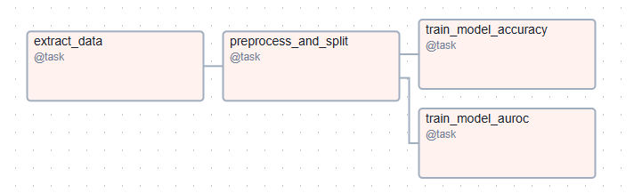

# Proyecto 3: Kubernetes, Prometheus y Grafana

### [🎥 Ver video en YouTube](https://youtu.be/SKmrt0lwFZg)


## Arquitecura del proyecto


Como se puede observar en la imagen superior, se utilizaron dos máquinas virtuales. Una de ellas se destinó exclusivamente al despliegue de los servicios relacionados con Apache Airflow, exponiendo únicamente el *webserver*. Para este propósito se utilizó **Docker Compose**.

En la otra máquina virtual, que aloja la mayoría de los servicios restantes, se empleó **MicroK8s** como orquestador, desplegando todos los componentes dentro de un mismo *namespace* de **Kubernetes**.

## Estructura del repositorio

Se creó una carpeta para cada uno de los servicios, donde se almacenan los archivos correspondientes a los recursos de tipo *Deployment*, *Service* y *PersistentVolumeClaim* (PVC), cuando son requeridos. Además, se creó una carpeta separada para los archivos relacionados con los recursos de tipo *PersistentVolume* (PV), ya que estos no están ligados a un *Pod* específico y pueden ser reclamados por cualquier *claim*. Las carpetas `hostPath` asociadas a los PV se encuentran fuera del repositorio.

```md
proyecto-3
├── airflow
├── grafana
├── images
├── inference-api
├── locust
├── minio
├── mlflow
├── mysql
├── observability
├── postgres
├── project-namespace.yaml
├── prometheus
├── pvs
├── README.md
└── streamlit
```

## Paso 1. Aseguramiento de imágenes

Dado que Kubernetes se encarga de orquestar contenedores pero no de construir imágenes, es necesario garantizar que todas las imágenes personalizadas estén disponibles en un repositorio como **Docker Hub**. En este proyecto, algunos servicios utilizan imágenes estándar proporcionadas por las tecnologías correspondientes, mientras que otros requieren imágenes personalizadas, ya sea reutilizadas de un proyecto anterior o creadas específicamente para este entorno. En estos casos, las imágenes personalizadas deben subirse previamente al repositorio de Docker Hub.

Un ejemplo claro de esta necesidad es el caso de la segunda máquina virtual, que debe utilizar una imagen personalizada de **Airflow** con las librerías necesarias para el entrenamiento. Para ello, se utilizan los siguientes comandos:

```bash
docker tag airflow-uv:latest jrpenagu/airflow-uv-ml:latest
docker push jrpenagu/airflow-uv-ml:latest 
```
Para los servicios de `inference-api`, `locust` y `streamlit`, se construyeron primero las imágenes, ya que dependen de nuevos desarrollos ajustados a los datos actualizados del caso de diabetes y a nuevos requerimientos específicos.

## Paso 2. Creación de *namespace* para proyecto

Con el fin de tener un entorno aislado para todos los despliegues del proyecto y garantizar que estos se encuentren en una misma red, donde puedan comunicarse entre sí utilizando únicamente sus nombres de servicio, se creó el *namespace* `project-3-mlops` con el siguiente manifiesto en YAML:

```yaml
apiVersion: v1
kind: Namespace
metadata:
  name: project-3-mlops
```

## Paso 3. Creación de PVs

Se crean todos los PVs que posteriormente serán reclamados por los *PersistentVolumeClaims* (PVCs) definidos en los despliegues. En total, se crean tres PVs, correspondientes a los servicios de `postgres`, `minio` y `mysql`:


## Paso 4. Carga de datos y entrenamiento de modelo

Una vez desplegados los servicios de `postgres` y `mlflow` (incluyendo sus servicios dependientes), se procede con la carga de datos y el entrenamiento del modelo a través de **Airflow**. Para ello, se crea el **DAG** `1-diabetes-training-pipeline`, que sigue el siguiente flujo:



En la tarea de `1-diabetes-training-pipeline`


## Paso 5. Elección de modelo en mlflow

## Paso 6. Despliegue API en docs e insercion en sql

## Paso 7. Streamlit

## Paso 8. Locust, Grafana, y Prometheus


