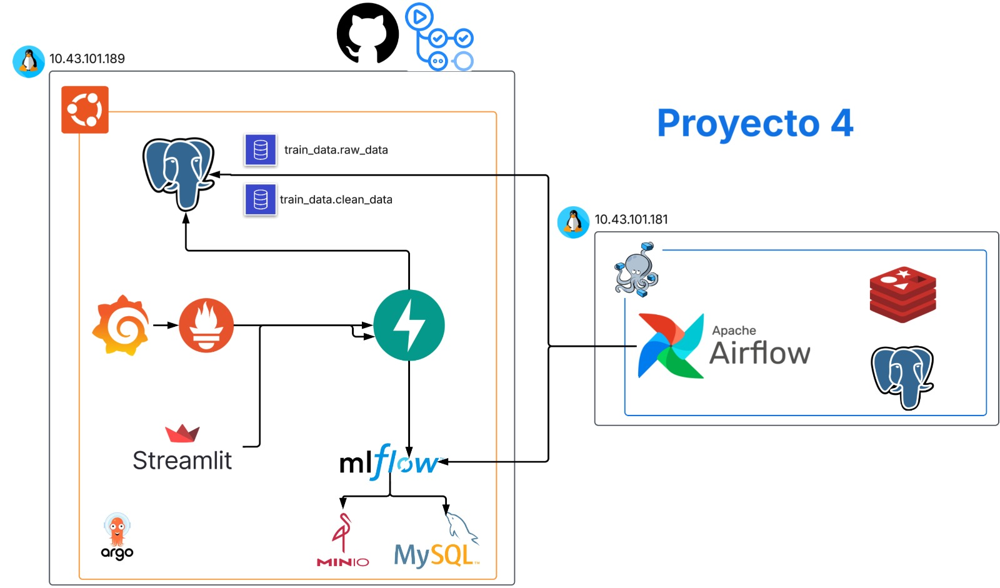

# Proyecto 4 MLOps

Este repositorio contiene todos los artefactos, configuraciones y manifiestos necesarios para construir, desplegar y operar un pipeline completo de Machine Learning orientado a MLOps. A continuación encontrarás:

### Descripción

El objetivo de este taller es desplegar un pipeline de MLOps que cubra todo el ciclo de vida de un modelo de Machine Learning, desde la ingesta de datos brutos hasta la entrega de resultados de inferencia a través de una API y una interfaz web.

### Componentes principales

1. **Airflow**: Orquesta la recolección, preprocesamiento y entrenamiento continuo de un modelo.
2. **MLflow**: Registra experimentos, métricas e historial de modelos.
3. **Bases de datos (PostgreSQL/MySQL)**: Almacenan datos RAW, datos limpios y metadatos para MLflow.
4. **MinIO**: Bucket que actúa como sistema de archivos para artefactos (modelos, reportes, logs).
5. **FastAPI (Inference API)**: Expone un endpoint REST para recibir solicitudes de inferencia usando el último modelo en producción.
6. **Streamlit (UI de inferencia)**: Interfaz web que permite al usuario final interactuar con el modelo, visualizar resultados y explorar versiones históricas.
7. **Prometheus & Grafana**: Capturan métricas de latencia y tráfico de la API para análisis en tiempo real.
8. **Locust**: Herramienta de pruebas de carga para evaluar el rendimiento de la Inference API.
9. **Argo CD**: GitOps para mantener todos los manifiestos de Kubernetes sincronizados y facilitar despliegues declarativos.

Todo lo anterior se ejecuta sobre un clúster Kubernetes (MicroK8s, EKS, GKE, etc.) y se basa en manifiestos organizados en carpetas “base/” y “overlays/” para facilitar la reutilización.

### Diagrama de arquitectura del proyect

### Estructura del repositorio

    ├── .argocd-apps/
    │   ├── airflow-app.yaml
    │   ├── inference-api-app.yaml
    │   ├── streamlit-app.yaml
    │   └── apps-of-apps.yaml
    │
    ├── apps/
    │   ├── airflow/
    │   │   ├── dags/
    │   │   │   ├── project-pipeline.py
    │   │   │   ├── raw_data_creation.sq
    │   │   │   └── utils.py
    │   │   └── image/
    │   │       ├── Dockerfile
    │   │       ├── pyproject.toml
    │   │       └── README.md
    │   │
    │   ├── inference-api/
    │   │   ├── Dockerfile
    │   │   ├── pyproject.toml
    │   │   ├── .python-version
    │   │   └── app/
    │   │       └── main.py
    │   │
    │   ├── streamlit/
    │   │   ├── Dockerfile
    │   │   ├── pyproject.toml
    │   │   ├── .python-version
    │   │   └── streamlit_app.py
    │   │
    │   └── locust/
    │       └── locustfile.py
    │
    ├── charts/
    │   └── airflow/
    │       └── Chart.yaml
    │
    ├── images/
    │   ├── arquitectura_proyecto.png
    │   ├── dag_flow.png
    │   └── ...
    │
    ├── k8s/
    │   ├── base/
    │   │   └── namespace.yaml
    │   │
    │   ├── airflow/
    │   │   └── values.yaml
    │   │
    │   ├── inference-api/
    │   │   ├── kustomization.yaml
    │   │   └── inference-api.yaml
    │   │
    │   ├── mlflow/
    │   │   ├── kustomization.yaml
    │   │   ├── mysql.yaml
    │   │   ├── mysql-pvc.yaml
    │   │   ├── minio.yaml
    │   │   ├── minio-pv.yaml
    │   │   └── mlflow.yaml
    │   │
    │   ├── observability/
    │   │   ├── kustomization.yaml
    │   │   ├── prometheus.yaml
    │   │   ├── grafana.yaml
    │   │   └── grafana-dashboard-config.yam
    │   │
    │   ├── postgres/
    │   │   ├── kustomization.yaml
    │   │   ├── postgres.yaml
    │   │   └── postgres-pvc.yaml
    │   │
    │   ├── pvs/
    │   │   ├── kustomization.yaml
    │   │   ├── minio-pv.yaml
    │   │   ├── mysql-pv.yaml
    │   │   └── postgres-pv.yaml
    │   │
    │   └── streamlit/
    │       ├── kustomization.yaml
    │       └── streamlit.yaml
    │
    ├── .argocd-apps/
    │   ├── airflow-app.yaml
    │   ├── inference-api-app.yaml
    │   ├── streamlit-app.yaml
    │   └── apps-of-apps.yaml
    │
    ├── Makefile / deploy.sh
    ├── README.md
    └── LICENSE

### Desarrollo

## 1. Creación automática del bucket Minio

Al desplegar MLflow en Kubernetes, necesitamos asegurarnos de que existan dos buckets en Minio para almacenar artefactos y datos relacionados:

- mlflows3
- api-artifacts

En lugar de crear manualmente estos buckets después de levantar Minio, se configuran _init containers_ dentro del Deployment de MLflow para:
- Esperar a que Minio esté listo.
- Crear (si no existen) los buckets necesarios.

De esta forma, cada vez que MLflow se inicie (o se redeploye), se garantiza que los buckets estén presentes, evitando errores de artefactos faltantes en tiempo de ejecución.

## 2. Grafana

ConfigMaps usados para provisionar automáticamente Grafana en Kubernetes: definir la fuente de datos (Prometheus), configurar el proveedor de dashboards (dashboard provider) y cargar el dashboard en sí (JSON).

**grafana-datasource**

- Este ConfigMap define la(s) fuente(s) de datos (datasource) que Grafana debe registrar al iniciar. En este caso, se le está indicando que agregue Prometheus como datasource por defecto, apuntando al servicio http://prometheus:9090. Grafana leerá automáticamente el contenido de datasource.yaml en /etc/grafana/provisioning/datasources/. Al levantar el pod de Grafana, encontrará el datasource “Prometheus” configurado, sin necesidad de hacerlo manualmente vía UI. Gracias a la clave isDefault: true, cualquier panel nuevo utilizará a Prometheus como fuente de métricas.

**grafana-dashboard-provider**

- Define la forma en que Grafana debe buscar archivos JSON de dashboards dentro del contenedor. Es el “dashboard provider” que apunta a un directorio local (/var/lib/grafana/dashboards). Se crea un ConfigMap que Grafana montará en /etc/grafana/provisioning/dashboards/provider.yaml. Grafana escaneará cada updateIntervalSeconds (10 s) la ruta /var/lib/grafana/dashboards en busca de archivos JSON. Al encontrar grafana-dashboard.json (u otros JSON), los cargará como dashboards “provisionados” en la organización (orgId = 1), sin permitir su eliminación desde la interfaz (disableDeletion: false significa que sí se pueden eliminar, pero suelen llenarse/reescribirse desde este provider). allowUiUpdates: true permite editarlo desde la UI, aunque cualquier cambio local puede perderse en el próximo reinicio si se sobrescribe el ConfigMap.

**rafana-dashboard-config**

- Contiene el JSON completo del dashboard que se desea provisionar en Grafana. El label grafana_dashboard: "1" hace que, al montar el ConfigMap en el directorio de dashboards, Grafana lo reconozca y lo cargue automáticamente. Grafana monta este ConfigMap (por ejemplo, bajo /var/lib/grafana/dashboards/grafana-dashboard.json). Gracias al “dashboard provider” configurado en grafana-dashboard-provider.yaml, Grafana detecta este archivo JSON y lo importa como un dashboard nuevo llamado “Tablero Proyecto 4”. Este JSON define: Paneles, fuentes de datos, métricas, expresiones PromQL (por ejemplo, rate(http_requests_total[5m])), disposición (gridPos), opciones de estilo (dark), intervalos de refresco (10 s), etc. Cada vez que se actualice este ConfigMap a nivel de Kubernetes, Grafana sobrescribirá el dashboard con la nueva versión del JSON.

## 3. Dag

Este DAG está diseñado para operar de manera completamente automática. Se encarga de procesar por lotes (batch) los datos de precios de casas, realizando tareas de carga, limpieza, entrenamiento y evaluación de modelos.

El pipeline incluye dos mecanismos clave:

    AirflowSkipException
    
En la primera tarea (evaluate_run_and_load_raw_data), si la API de datos indica que no hay más lotes disponibles (o retorna un error HTTP), se lanza esta excepción. Esto detiene el DAG sin marcarlo como fallido, evitando así ejecuciones innecesarias y previendo loops infinitos.

    TriggerDagRunOperator
    
Cuando todas las tareas se ejecutan correctamente, esta operación dispara automáticamente una nueva ejecución del mismo DAG para procesar el siguiente lote. Así se logra una secuencia encadenada de ejecuciones sin intervención manual.

Este mecanismo permite que el pipeline:
- Se reinicie automáticamente cuando se procesó un lote exitosamente.
- Se detenga de forma segura cuando ya no hay más datos por procesar.

El pipeline es completamente autónomo, procesando cada lote de datos de forma escalonada hasta agotar la fuente sin necesidad de loops explícitos.

## 4. Pipeline

El flujo de entrenamiento está diseñado con una lógica robusta de control de versiones de modelos y comparación de desempeño utilizando MLflow.

**Funciones principales**

    evaluate_run_and_load_raw_data:
Obtiene el lote desde una API externa y lo almacena en la base de datos.

    preprocess_and_split:
Limpia los datos, crea bins de precios para estratificación y separa en conjuntos de entrenamiento y prueba.

    train_decesision:
Evalúa si el tamaño del nuevo lote justifica reentrenar el modelo (se entrena si el 60% o más de los datos son nuevos).

    train_model:
Entrena el modelo con LinearRegression y OneHotEncoder, evalúa el desempeño con custom_reports_regression y lo registra en MLflow.

**Lógica de "Champion" y "Challenger"**

El pipeline implementa una lógica de control de versiones y evaluación progresiva:

- El primer modelo (lote 0) se registra automáticamente como champion.

- Los modelos entrenados en lotes posteriores se registran como challenger.

- Se comparan las métricas de evaluación, especialmente el RMSE.

- Si el modelo challenger tiene mejor o igual RMSE que el actual champion, entonces:

- Se actualiza el alias champion en MLflow.

- Se llama a la API de inferencia para cargar el nuevo modelo.

Esta arquitectura permite que solo los mejores modelos pasen a producción, garantizando mejoras continuas en el sistema sin necesidad de supervisión manual.

## 5. Github Actions

### Conclusiones

Este taller provee una guía paso a paso para implementar un pipeline de MLOps completo, incluyendo:
- Orquestación del flujo de datos y entrenamiento con Airflow.
- Registro de experimentos y modelos con MLflow (MySQL + MinIO).
- Exposición de un servicio REST para inferencia (FastAPI) y visualización de resultados (Streamlit).
- Monitoreo de métricas en tiempo real con Prometheus y Grafana.
- Pruebas de carga con Locust.
- Aprovisionamiento declarativo de recursos en Kubernetes usando manifiestos Kustomize y sincronización con Argo CD.

Al finalizar estos pasos, contarás con un entorno replicable donde cada componente reside en su propio contenedor, garantiza escalabilidad y ofrece trazabilidad total del ciclo de vida del modelo.
