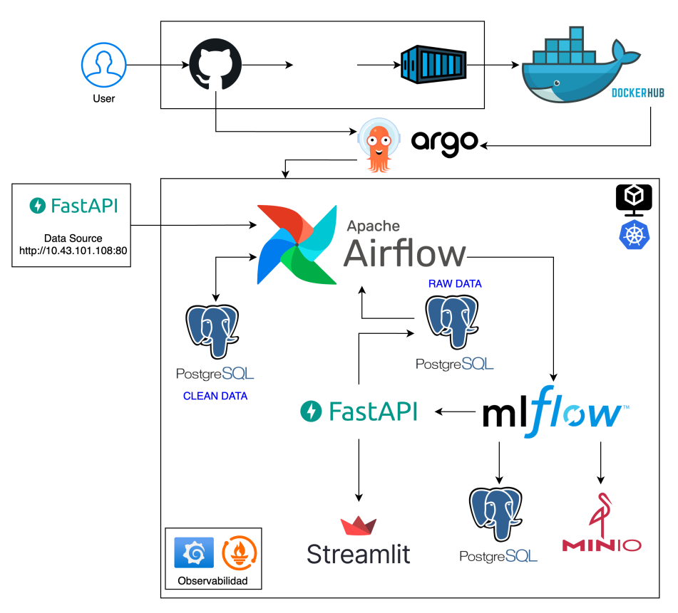

# Proyecto 4 MLOps

Este repositorio contiene todos los artefactos, configuraciones y manifiestos necesarios para construir, desplegar y operar un pipeline completo de Machine Learning orientado a MLOps. A continuación encontrarás:

### Descripción

El objetivo de este taller es desplegar un pipeline de MLOps que cubra todo el ciclo de vida de un modelo de Machine Learning, desde la ingesta de datos brutos hasta la entrega de resultados de inferencia a través de una API y una interfaz web.

### Componentes principales

1. **Airflow**: Orquesta la recolección, preprocesamiento y entrenamiento continuo de un modelo.
2. **MLflow**: Registra experimentos, métricas e historial de modelos.
3. **Bases de datos (PostgreSQL/MySQL)**: Almacenan datos RAW, datos limpios y metadatos para MLflow.
4. **MinIO**: Bucket que actúa como sistema de archivos para artefactos (modelos, reportes, logs).
5. **FastAPI (Inference API)**: Expone un endpoint REST para recibir solicitudes de inferencia usando el último modelo en producción.
6. **Streamlit (UI de inferencia)**: Interfaz web que permite al usuario final interactuar con el modelo, visualizar resultados y explorar versiones históricas.
7. **Prometheus & Grafana**: Capturan métricas de latencia y tráfico de la API para análisis en tiempo real.
8. **Locust**: Herramienta de pruebas de carga para evaluar el rendimiento de la Inference API.
9. **Argo CD**: GitOps para mantener todos los manifiestos de Kubernetes sincronizados y facilitar despliegues declarativos.

Todo lo anterior se ejecuta sobre un clúster Kubernetes (MicroK8s, EKS, GKE, etc.) y se basa en manifiestos organizados en carpetas “base/” y “overlays/” para facilitar la reutilización.

### Diagrama de arquitectura del proyect

1. **Airflow**
   - Se despliega en su propio namespace (`airflow`) y ejecuta DAGs periódicos que:
     1. Llaman a una fuente de datos externa para obtener subconjuntos incrementales (API Data Source).
     2. Guardan datos RAW en PostgreSQL.
     3. Ejecutan preprocesamiento y split de datasets en tablas de `clean_data`.
     4. Lanzan tareas de entrenamiento con Optuna para ajustar hiperparámetros de un modelo (Random Forest, XGBoost, etc.).
     5. Registran cada experimento en MLflow y marcan el mejor modelo como “production”.

2. **Bases de Datos y Bucket**
   - **PostgreSQL** (namespace `postgres`) para `raw_data` y tablas auxiliares de Airflow.
   - **MySQL** (namespace `mysql`) para almacenar metadatos de MLflow (experimentos, runs, artefactos).
   - **MinIO** (namespace `minio`) simula un bucket S3 para guardar artefactos de MLflow (modelos, gráficas SHAP, reportes).

3. **MLflow** (namespace `mlflow`)
   - Conecta a MySQL para metadatos y a MinIO para guardado de artefactos.
   - UI disponible en el puerto configurado (ej. `http://<IP-cluster>:32000`).

4. **Inference API** (namespace `inference-api`)
   - API REST implementada con FastAPI (`apps/inference-api`):
     - Endpoint `POST /load_model/` para cargar el modelo de producción desde MLflow.
     - Endpoint `POST /predict/` que recibe datos de entrada, produce una predicción y registra el evento de inferencia en la tabla `inference_log` de PostgreSQL.
     - Métricas expuestas en `/metrics` para Scraping por Prometheus (`REQUEST_COUNT`, `REQUEST_LATENCY`).

5. **Streamlit UI** (namespace `streamlit`)
   - Interfaz web interactiva (`apps/streamlit/streamlit_app.py`) que:
     1. Permite seleccionar características mediante dropdowns y sliders.
     2. Muestra la predicción y la categoría resultante.
     3. Incluye panel de “Historial de Modelos” obteniendo metadata de MLflow.
     4. Visualiza gráficas SHAP del último modelo en producción.

6. **Observabilidad** (namespace `observability`)
   - **Prometheus**: Scrapea métricas de Inference API cada 5 s.
   - **Grafana**: Dashboard listo para visualizar:
     - Peticiones por segundo (`rate(predict_requests_total[1m])`).
     - Contador total de peticiones (`sum(predict_requests_total)`).
     - Latencia promedio (`rate(predict_latency_seconds_sum[1m]) / rate(predict_latency_seconds_count[1m])`).

7. **Locust** (namespace `locust`)
   - Script de carga (`apps/locust/locustfile.py`, no incluido en esta versión) que genera tráfico contra `inference-api` para validar escalabilidad y comportamiento bajo carga.

8. **Argo CD** (namespace `argocd`)
   - Configuraciones en `.argocd-apps/` que definen cada aplicación (Airflow, MLflow, Inference API, Streamlit, Observability) como un “App of Apps”.
   - Al aplicar `apps-of-apps.yaml`, Argo CD sincroniza automáticamente todos los manifests en `k8s/` y `charts/`.  

### Estructura del repositorio

    ├── .argocd-apps/
    │   ├── airflow-app.yaml
    │   ├── inference-api-app.yaml
    │   ├── streamlit-app.yaml
    │   └── apps-of-apps.yaml
    │
    ├── apps/
    │   ├── airflow/
    │   │   ├── dags/
    │   │   │   ├── project-pipeline.py
    │   │   │   ├── raw_data_creation.sq
    │   │   │   └── utils.py
    │   │   └── image/
    │   │       ├── Dockerfile
    │   │       ├── pyproject.toml
    │   │       └── README.md
    │   │
    │   ├── inference-api/
    │   │   ├── Dockerfile
    │   │   ├── pyproject.toml
    │   │   ├── .python-version
    │   │   └── app/
    │   │       └── main.py
    │   │
    │   ├── streamlit/
    │   │   ├── Dockerfile
    │   │   ├── pyproject.toml
    │   │   ├── .python-version
    │   │   └── streamlit_app.py
    │   │
    │   └── locust/
    │       └── locustfile.py
    │
    ├── charts/
    │   └── airflow/
    │       └── Chart.yaml
    │
    ├── images/
    │   ├── arquitectura_proyecto.png
    │   ├── dag_flow.png
    │   └── ...
    │
    ├── k8s/
    │   ├── base/
    │   │   └── namespace.yaml
    │   │
    │   ├── airflow/
    │   │   └── values.yaml
    │   │
    │   ├── inference-api/
    │   │   ├── kustomization.yaml
    │   │   └── inference-api.yaml
    │   │
    │   ├── mlflow/
    │   │   ├── kustomization.yaml
    │   │   ├── mysql.yaml
    │   │   ├── mysql-pvc.yaml
    │   │   ├── minio.yaml
    │   │   ├── minio-pv.yaml
    │   │   └── mlflow.yaml
    │   │
    │   ├── observability/
    │   │   ├── kustomization.yaml
    │   │   ├── prometheus.yaml
    │   │   ├── grafana.yaml
    │   │   └── grafana-dashboard-config.yam
    │   │
    │   ├── postgres/
    │   │   ├── kustomization.yaml
    │   │   ├── postgres.yaml
    │   │   └── postgres-pvc.yaml
    │   │
    │   ├── pvs/
    │   │   ├── kustomization.yaml
    │   │   ├── minio-pv.yaml
    │   │   ├── mysql-pv.yaml
    │   │   └── postgres-pv.yaml
    │   │
    │   └── streamlit/
    │       ├── kustomization.yaml
    │       └── streamlit.yaml
    │
    ├── .argocd-apps/
    │   ├── airflow-app.yaml
    │   ├── inference-api-app.yaml
    │   ├── streamlit-app.yaml
    │   └── apps-of-apps.yaml
    │
    ├── Makefile / deploy.sh
    ├── README.md
    └── LICENSE

### Preparación

Requisitos Locales

- Tener instalado kubectl y acceso a un clúster Kubernetes (MicroK8s, EKS, GKE, etc.
- Tener instalado helm (si se opta por desplegar Airflow vía Helm Chart).

- Instalar argocd CLI para interactuar con Argo CD (opcional, se puede usar UI web).

- Tener docker y estar autenticado en Docker Hub (o registro privado) para publicar imágenes.

- Versión de Python 3.10.x (o superior) para construir imágenes de Airflow, Inference API y Streamlit.

**Variables y Secretos**

- DOCKER_USERNAME y DOCKER_PASSWORD en local (para docker login y push).

- Configurar credenciales de MinIO (usuario/contraseña) vía Secret de Kubernetes o values.yaml de Helm.

- Ajustar las cadenas de conexión (CONNECTION_STRING) en apps/inference-api/app/main.py y DAG de Airflow a la URL de PostgreSQL/MySQL del clúster.

**Acceso a Argo CD**

- Instalar Argo CD en el clúster (kubectl create namespace argocd && kubectl apply -n argocd -f https://raw.githubusercontent.com/argoproj/argo-cd/stable/manifests/install.yaml).

- Exponer el argocd-server (LoadBalancer o port-forward).

- Loguearse vía CLI:

- argocd login <ARGOCD_SERVER> --username admin --password <ARGOCD_INITIAL_PASSWORD>

### Construcción y Publicación de Imágenes Docker

Cada aplicación (Airflow, Inference API, Streamlit, Locust) tiene su propio Dockerfile en apps/<nombre-app>/Dockerfile.

    *Ubicado en apps/inference-api/*
    docker build -t <DOCKER_USERNAME>/inference-api:latest .
    docker push <DOCKER_USERNAME>/inference-api:latest

Repetir paso equivalente para:

**Airflow**

    cd apps/airflow/image
    docker build -t <DOCKER_USERNAME>/airflow-ml:latest .
    docker push <DOCKER_USERNAME>/airflow-ml:latest

**Streamlit UI**

    cd apps/streamlit
    docker build -t <DOCKER_USERNAME>/streamlit-ml:latest .
    docker push <DOCKER_USERNAME>/streamlit-ml:latest

**Locust**

    cd apps/locust
    docker build -t <DOCKER_USERNAME>/locust-ml:latest .
    docker push <DOCKER_USERNAME>/locust-ml:latest

### Despliegue con Kubernetes

A continuación se describe el flujo de despliegue “GitOps” con Kustomize y Argo CD. Si deseas hacerlo manual sin Argo CD, basta con aplicar cada directorio en orden.

**Crear Namespaces y Recursos Comunes**

    kubectl apply -k k8s/base

Este comando crea todos los namespaces necesarios (airflow, mlflow, inference-api, streamlit, observability, postgres, pvs, mysql, minio, argocd).

**Provisionar PersistentVolume**

    kubectl apply -k k8s/pvs

Esto desplegará tres PVs:

- minio-pv.yaml: Volumen para almacenar artefactos de MinIO.- 
- mysql-pv.yaml: Volumen para la base de datos MySQL de MLflow.- 
- postgres-pv.yaml: Volumen para la base de datos PostgreSQL (Airflow, logs, RAW data).- 
- Los PVs están definidos con hostPath u otra clase de almacenamiento según la plataforma. Verifica que el path exista o adapta según tu entorno.

**Desplegar Bases de Datos y MinIO**

PostgreSQL (Airflow & RAW data)

    kubectl apply -k k8s/postgres

    postgres.yaml: StatefulSet + Service.

    postgres-pvc.yaml: PersistentVolumeClaim asociado.

*MySQL (MLflow Metadata)*

    kubectl apply -k k8s/mlflow

En la carpeta k8s/mlflow/ encontrarás:

    mysql.yaml y mysql-pvc.yaml para MySQL.

    minio.yaml y minio-pv.yaml para MinIO.

    mlflow.yaml: Deployment y Service de MLflow apuntando a MySQL y MinIO.

    Importante: Antes de aplicar mlflow.yaml, espera a que MySQL y MinIO estén en estado Running.

**Desplegar Airflow**

    kubectl apply -k k8s/airflow

Dentro de k8s/airflow/values.yaml (si se utilizó Helm Chart) o manifiestos raw en k8s/airflow/ (Adaptados a Kustomize) se define:

- Deployment del scheduler y workers.

- Webserver expuesto vía Service (NodePort o LoadBalancer).

- Conexiones a PostgreSQL para metadata de Airflow y a MinIO para almacenar logs/artefactos si es necesario.

**Desplegar Inference API**

    kubectl apply -k k8s/inference-api

inference-api.yaml contiene:

- Deployment: Imagen <DOCKER_USERNAME>/inference-api:latest, variables de entorno para cadena de conexión a PostgreSQL (inference logs).

- Service: Expone inference-api en puerto (ej. 8989).

- ServiceMonitor o ConfigMap para Prometheus (scrape config).

- El endpoint quedará disponible en http://<IP-cluster>:<NodePort>/predict/ y /metrics para Prometheus.

**Desplegar Streamlit UI**

    kubectl apply -k k8s/streamlit

streamlit.yaml:

- Deployment: Imagen <DOCKER_USERNAME>/streamlit-ml:latest, variables de entorno para conectar a MLflow (URL de MySQL) y a Inference API.

- Service: Tipo LoadBalancer o NodePort en el puerto 8501.

- La UI estará disponible en http://<IP-cluster>:8501.

**Desplegar Observabilidad (Prometheus & Grafana)**

    kubectl apply -k k8s/observability

prometheus.yaml:

- Deployment: Prometheus con ConfigMap que define targets (inference-api:8989/metrics).

- Service: Exponer puerto 9090.

- grafana.yaml + grafana-dashboard-config.yaml:

- Deployment: Grafana con volumen montado que carga dashboard automáticamente.

- Service: Exponer puerto 3000.

Acceder a Grafana en http://<IP-cluster>:3000 (usuario/contraseña por defecto: admin/admin;

### Despliegue Automático con Argo CD (GitOps)

Si se desea mantener el flujo GitOps, basta con aplicar el “App of Apps” en Argo CD.

Añade el repositorio a Argo CD:

    argocd repo add https://github.com/<TU_USUARIO>/proyecto-4.git \
    --username <TU_USUARIO> \
    --password <TOKEN_PERSONAL>

Crear la aplicación raíz (puede hacerse también en el UI de Argo CD):

    argocd app create proyecto-4-of-apps \
    --repo https://github.com/<TU_USUARIO>/proyecto-4.git \
    --path .argocd-apps/apps-of-apps.yaml \
    --dest-server https://kubernetes.default.svc \
    --dest-namespace argocd

Sincronizar la aplicación raíz:

    argocd app sync proyecto-4-of-apps

Con esto, Argo CD detectará automáticamente las aplicaciones definidas en .argocd-apps/ (Airflow, MLflow, Inference API, Streamlit, Observability) y las desplegará en el orden correcto, monitorizando el estado de cada recurso.

### Validaciones y Pruebas

**Verificar Pods y Servicios**

    kubectl get pods --all-namespaces
    kubectl get svc --all-namespaces

El namespace airflow debe mostrar airflow-webserver, airflow-scheduler, airflow-worker, etc., todos en estado Running.

**Probar Endpoints**

- Airflow UI: http://<IP-cluster>:<NodePort-Airflow>.

- MLflow UI: http://<IP-cluster>:32000.

**Probar Dashboards en Grafana**

Iniciar sesión en http://<IP-cluster>:3000 con admin/admin.

Verifica que el dashboard “ML Ops Inference” (o nombre definido) muestre panels cargados automáticamente.

Verifica que en Prometheus (http://<IP-cluster>:9090) puedas ejecutar expresiones como:

    rate(predict_requests_total[1m])

    rate(predict_latency_seconds_sum[1m]) / rate(predict_latency_seconds_count[1m])

**Validar Airflow**

- Accede a http://<IP-cluster>:8080 (puerto del Webserver).

Verifica que el DAG project-pipeline aparezca en verde (correctamente habilitado).
Ejecuta manualmente el DAG la primera vez para asegurarte de que:

- Crea la tabla raw_data en PostgreSQL.
- Llena la tabla con datos ejemplo (usar raw_data_creation.sql).
- Divide y guarda el dataset en clean_data.
- Corre el entrenamiento, registra en MLflow y marca el modelo.

### Panel de Configuración de Kustomize

Cada subcarpeta bajo k8s/ tiene un kustomization.yaml que define:

- inference-api.yaml

-patchesStrategicMerge:
  - service-monitor.yaml   # Configuración para Prometheus

-Para aplicar únicamente el componente de Streamlit, por ejemplo:

    kubectl apply -k k8s/streamlit

-Para aplicar todo el proyecto “en orden” (sin Argo CD), se puede usar un script o Makefile:

    PHONY: all apply

-namespaces:

    kubectl apply -k k8s/base

-pvs:
    kubectl apply -k k8s/pvs

-databases:

    kubectl apply -k k8s/postgres
    kubectl apply -k k8s/mlflow  # Esto incluye MySQL + MinIO

-mlflow:

    kubectl apply -k k8s/mlflow

-airflow:

    kubectl apply -k k8s/airflow

-inference:
    kubectl apply -k k8s/inference-api

-streamlit:
    kubectl apply -k k8s/streamlit

-observability:
    kubectl apply -k k8s/observability

*Ejecutar:*

    make all

### Flujo de Trabajo del DAG de Airflow

Dentro de apps/airflow/dags/project-pipeline.py se define el DAG project_pipeline con las siguientes tareas principales:

- create_raw_tables:

    Usa el archivo SQL raw_data_creation.sql para crear la tabla raw_data en PostgreSQL.

- extract_data:

    Consulta a la API externa (por ejemplo: http://datos.externo/api/group=<n>&date=<fecha>) para obtener un subconjunto incremental de datos.
    Inserta los datos en raw_data en bloques de 15,000 filas para no saturar la DB.

- preprocess_and_split:

    Lee toda la tabla raw_data, elimina columnas irrelevantes, stratified split en train/validation/test (train_test_split con stratify en variable objetivo).
    Crea/llena la tabla clean_data en PostgreSQL con la etiqueta dataset (train/validation/test).

- train_model_accuracy y train_model_auroc (tareas paralelas):

    Entrenan un modelo (e.g., Random Forest) optimizando hiperparámetros vía Optuna para maximizar accuracy (primer flujo) y AUROC (segundo flujo).

    Cada tarea registra en MLflow parámetros, métricas y artefactos (gráficas SHAP).

- register_champion_model:

    Compara los dos experiments en MLflow y marca con el alias production al modelo con mejor desempeño general.

El flujo de DAG se representa en images/dag_flow.png y se asemeja a:

    DAG Flow

Para ejecutar manualmente:

    kubectl port-forward svc/airflow-webserver 8080:8080 -n airflow

### Mantenimiento y Actualizaciones

Actualizar versión de imagen

Cuando modifiques el código de Airflow, Inference API o Streamlit, reconstruye la imagen:

    cd apps/<app>
    docker build -t <DOCKER_USERNAME>/<app>:v2.0.0 .
    docker push <DOCKER_USERNAME>/<app>:v2.0.0

- Actualiza la etiqueta image: en el manifiesto correspondiente (e.g., k8s/inference-api/inference-api.yaml) y aplica el patch:

        kubectl set image deployment/inference-api inference-api=<DOCKER_USERNAME>/inference-api:v2.0.0 -n inference-api

- Verifica que el nuevo pod esté en estado Running y sirviendo la nueva versión.

- Actualizar DAGs de Airflow

- Sube el código modificado a la rama principal del repositorio.

        Argo CD detectará cambios en apps/airflow/image/Dockerfile o en k8s/airflow/ y redeplegará el Webserver/Workers con la nueva imagen.

- Gestión de Versiones en MLflow

    Cada nuevo entrenamiento generará un nuevo “run” en MLflow.

    - El mejor modelo se marcará con el tag production.

    - Si en algún momento deseas “retroceder” a una versión anterior, puedes usar la UI de MLflow para re-assignar el tag production.

- Backup y Recuperación de Datos

Realiza snapshots de los volúmenes postgres y mysql periódicamente (dependiendo del proveedor de almacenamiento).

Para MinIO, configura la replicación de buckets o exporta los artefactos críticos a un bucket externo.

### Conclusiones

Este taller provee una guía paso a paso para implementar un pipeline de MLOps completo, incluyendo:
- Orquestación del flujo de datos y entrenamiento con Airflow.
- Registro de experimentos y modelos con MLflow (MySQL + MinIO).
- Exposición de un servicio REST para inferencia (FastAPI) y visualización de resultados (Streamlit).
- Monitoreo de métricas en tiempo real con Prometheus y Grafana.
- Pruebas de carga con Locust.
- Aprovisionamiento declarativo de recursos en Kubernetes usando manifiestos Kustomize y sincronización con Argo CD.

Al finalizar estos pasos, contarás con un entorno replicable donde cada componente reside en su propio contenedor, garantiza escalabilidad y ofrece trazabilidad total del ciclo de vida del modelo.
